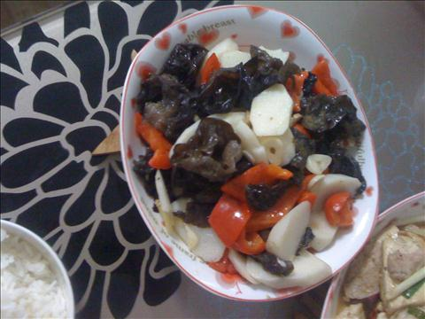

山药木耳炒红椒
===============================

## 食材 ##
* 山药:0.5根
* 木耳:1小把
* 葱姜蒜:少许
* 瘦肉:2两
* 红椒:1个
## 步骤 ##
### 1. 泡发木耳，去蒂，洗净备用 ###
泡发木耳：将木耳浸泡在水中，使木耳吸水膨胀。
用冷水浸泡木耳发泡效果好，但所需要的时间较长。
用热水浸泡时间短，但效果没有冷水的好。
### 1. 山药去皮洗净后切片，用水加少量盐浸泡备用 ###
### 2. 红椒切块备用 ###
### 3. 瘦肉切片备用 ###
### 4. 姜蒜爆锅 ###
### 5. 加入瘦肉片翻炒 ###
### 6. 肉片炒至变色加入山药和红椒继续翻炒 ###
### 7. 待辣椒炒软后，加入调料，出锅 ###

