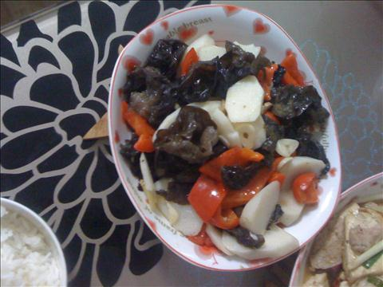

山药木耳炒红椒
===============================

## 食材 ##
* 山药:0.5根
* 葱姜蒜:少许
* 瘦肉:2两
* 红椒:1个
## 步骤 ##
### 1. 山药去皮切片，用水加少量盐浸泡备用 ###
### 2. 红椒切块备用 ###
### 3. 瘦肉切片备用 ###
### 4. 从姜蒜爆锅 ###
### 5. 加入瘦肉片翻炒 ###
### 6. 肉片炒至变色加入山药和红椒翻炒 ###
### 7. 加入调料 出锅 ###
