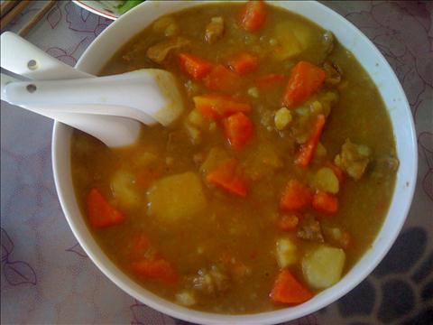
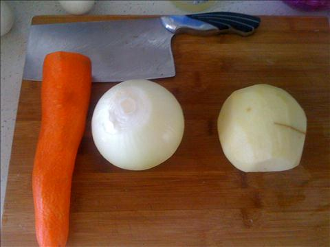
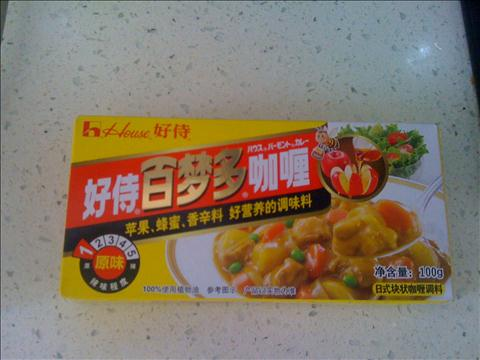
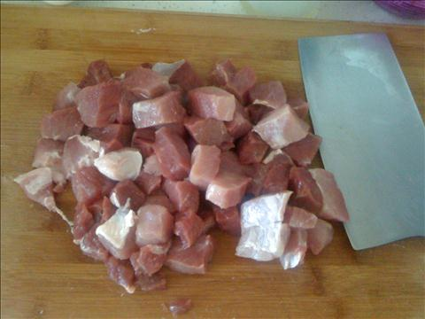
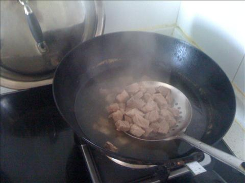
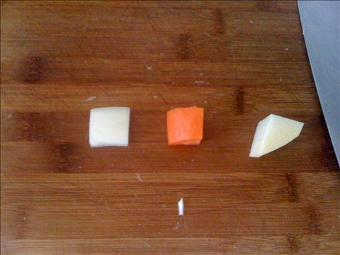
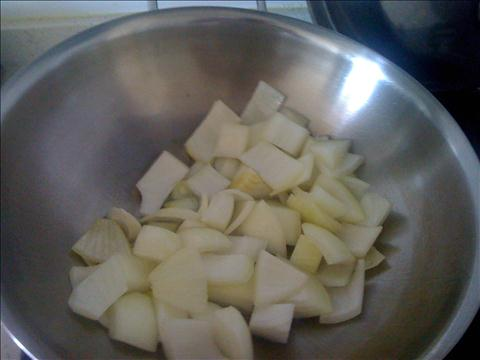
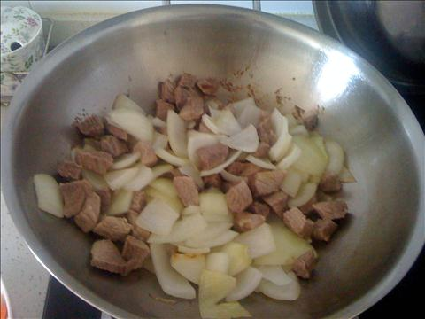
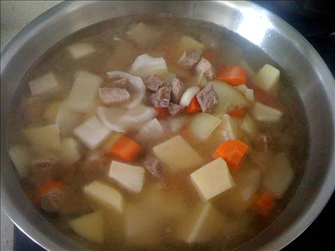

咖喱牛肉
=========================

## 食材 ##
* 牛肉:4两
* 圆葱:1颗
* 胡萝卜:1根
* 土豆:2个
* 咖喱块:3块

## 做法 ##
### 1. 牛肉切块儿 ###

### 2. 将切好块的牛肉，焯一下捞出备用 ###
焯水：冷水下肉，水沸两分钟后, 撇掉血水和沫子，将肉捞出沥干备用。

### 3. 将圆葱，胡萝卜，土豆切块备用 ###
焯牛肉和切块可同时进行，以便节约时间

### 4. 冷锅，下油，油开后下圆葱爆锅 ###

### 5. 加牛肉，放入盐翻继续翻炒

### 6. 加入水后，炖20-40分钟 ###
* 开大火至沸腾后，加入咖喱块, 然后调整至中火慢炖。
* 时间根据肉质和肉块的大小决定。
* 水量保证炖的时候不要糊锅（一般没过牛肉块，就可以）如果不够后期可以再补水。
* 火候很重要，中火慢炖可以保证牛肉入味。
* 咖喱块的数量一般是两块儿，可依据个人口味和食材的多少，自行增减。

### 7. 放胡萝卜块和土豆块，大火炖至水沸后再次转中火慢炖20分钟 ###
* 开锅时,注意观察水量，水少的话可以补些水进去。
* 中火慢炖保证土豆块和胡萝卜块入味。

### 8. 开锅换大火收汤至粘稠状出锅 ###
* 喜多汁或怕糊锅，可略过此步骤，直接出锅。
* 如果炖的时间较短，土豆没有碎，可边收汤，边把土豆用铲子捣碎，这样会更加粘稠入味。

