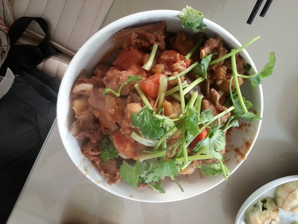

红烧羊排
========================

2014年11月，第二次制作

2014年1月，第一次制作
## 食材 ##
* 羊排

* 土豆
* 胡萝卜

* 葱，姜，蒜，香叶，八角，干辣椒
* 盐，糖，鸡精，五香粉
* 生抽，红烧酱油，醋

## 步骤 ##

1. 羊排洗净，冷水入锅，水开后焯5分钟后，捞出备用。

2. 土豆，胡萝卜切块。

3. 葱花爆锅，下入羊排翻炒。

4. 加水至莫过羊排，加入调料，水开后换中火炖60分钟（本人炖40分钟羊排没有炖烂），
期间注意观察锅中水位，水少则添水，避免糊锅。

5. 加入土豆块和胡萝卜块（如水量不足，则可适当补水），继续炖15分。

6. 开盖，收汤。
