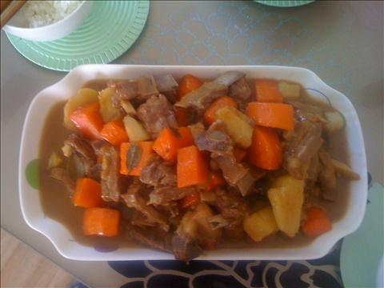
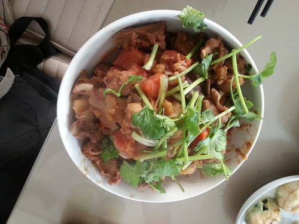
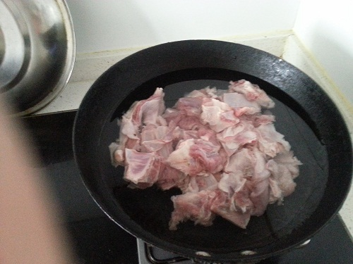
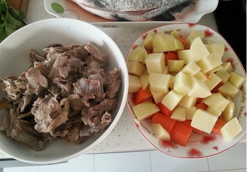

红烧羊排
========================

2014年11月，更新

2014年1月
## 食材 ##
* 羊排
* 土豆
* 胡萝卜
* 葱，姜，蒜，香叶，八角，干辣椒
* 盐，糖，鸡精，五香粉
* 生抽，红烧酱油，醋

## 步骤 ##

### 1. 羊排洗净，焯水 ###
冷水放入羊排，水沸5分钟后，捞出备用。

### 2. 土豆，胡萝卜切块 ###

### 3. 葱姜蒜爆锅后，下入羊排翻炒 ###
葱姜蒜要大块，冷油下锅，油热后调制小火下入羊排翻炒。
翻炒过程中，加入料酒和生抽。料酒去腥，生抽提鲜。

### 4. 加水，加入香叶，水开后换小火炖60分钟 ###
期间注意观察锅中水位，水少则添水，避免糊锅。

### 5. 加入土豆块和胡萝卜块（如水量不足，则可适当补水），继续炖15分。###

### 6. 开盖换大火收汁后出锅呈盘。###
