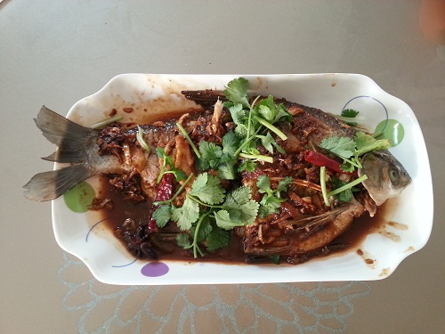
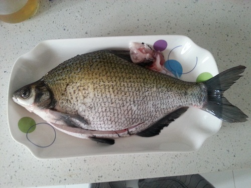
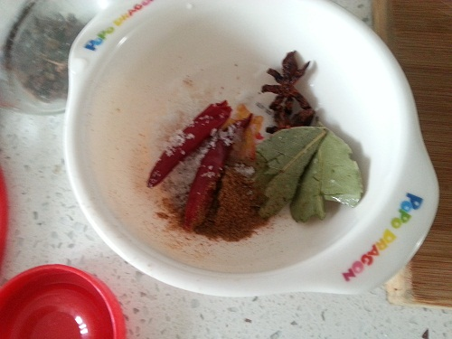
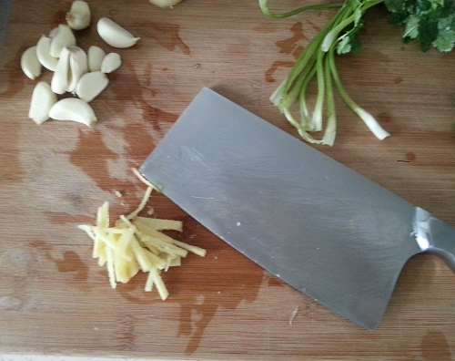
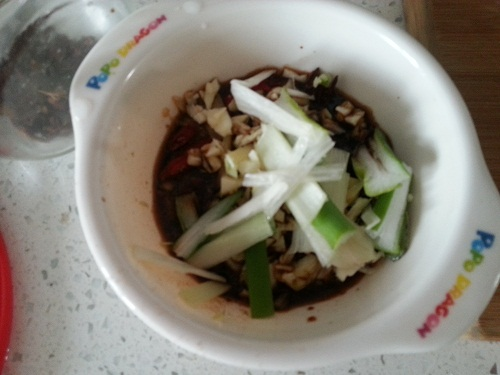

红烧武昌鱼
==================

## 食材 ##

* 武昌鱼:1 条
* 葱，姜，蒜，香叶，八角，干辣椒:若干
* 盐，糖，鸡精，五香粉:若干
* 生抽，红烧酱油，醋

## 步骤 ##

### 1. 鱼洗净，在鱼身两面划几刀，便于入味 ###

清洗鱼要把鱼肚子上的黑皮都去掉。鳃和鱼头的血水冲洗干净。

### 2. 肚子里塞进生姜片，全身用料酒和盐涂抹腌制10分钟，去腥 ###

### 3. 葱姜切丝，蒜切碎，香叶，八角，干辣椒洗净，盐、糖、鸡精、五香粉、 生抽、红烧酱油、醋加入调料盒中备用 ###

### 3. 冷油下花椒，待油热后关火，沥净花椒 ###

### 4. 再次开火，将鱼两面过油煎 ###

### 5. 加入调料，添水没过鱼的一面 ###

### 6. 大火至水开，调制小火炖15分钟左右 ###
慢火炖鱼，越炖越入味。

### 7. 开盖，大火收汤 ###
