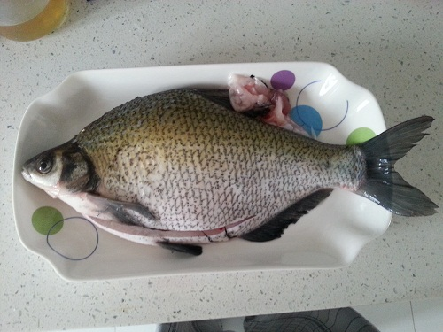
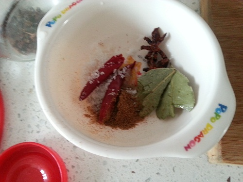
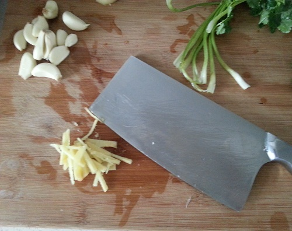
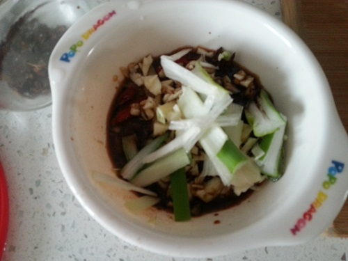

红烧武昌鱼
==================

## 食材 ##

* 武昌鱼 一条

* 葱，姜，蒜，香叶，八角，干辣椒
* 盐，糖，鸡精，五香粉

* 生抽，红烧酱油，醋

## 步骤 ##

1. 鱼洗净，肚子里塞进生姜片，全身用料酒和盐涂抹腌制10分钟，去腥。

2. 葱姜切丝，蒜切碎，香叶，八角，干辣椒洗净，盐、糖、鸡精、五香粉、 生抽、红烧酱
油、醋加入调料盒中备用。

3. 冷油下花椒，待油热后关火，沥净花椒。

4. 再次开火，将鱼两面过油煎。

5. 加入调料，添水没过鱼的一面。

6. 大火至水开，调制中火炖十分钟。

7. 开盖，大火收汤。
