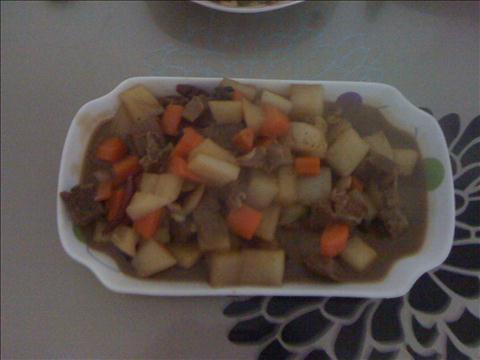
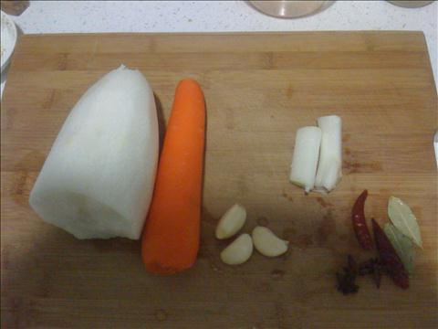
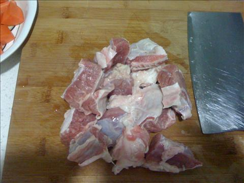
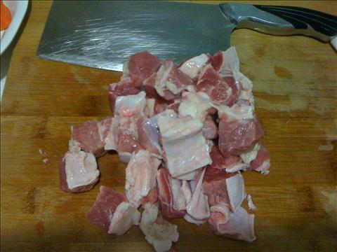
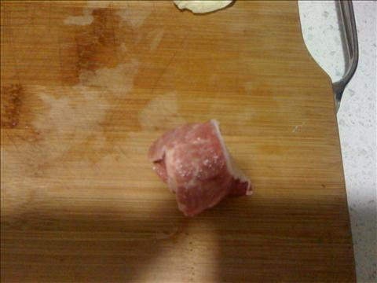
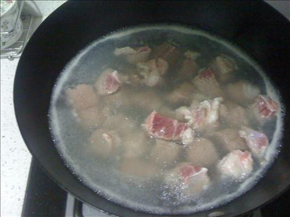
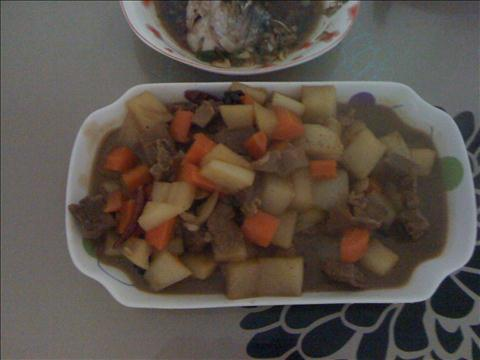

牛腩炖萝卜
===============================

## 食材 ##
* 白萝卜:0.5根
* 胡萝卜:1根
* 蒜瓣，葱段:若干
* 干辣椒，八角，香叶:若干

## 步骤 ##
### 1. 牛腩切小块 ###

### 2. 焯牛腩块 ###
热水下锅焯

### 3. 蒜瓣葱段爆锅 ###
### 4. 焯过的牛腩入锅小火炒 ###
### 5. 加入料酒和生抽 ###
料酒去腥，生抽量多一些，保证所有牛腩块都被上色
### 6. 加入热水没过牛肉 ###
### 7. 水开后转小火炖60分钟 ###
40分钟时，注意观察锅中水量，适当补水，避免炖干锅
### 8. 加入白萝卜和胡萝卜转大火开锅后转小火继续炖20分钟 ###
### 9. 大火收汤后出锅 ###

