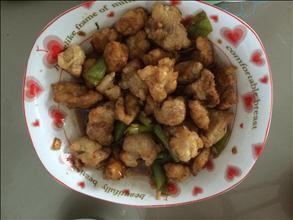
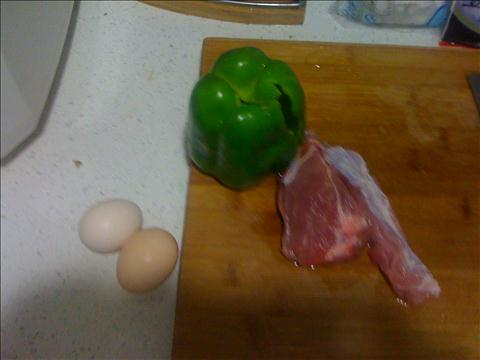

溜肉段
===============================

## 食材 ##
* 里脊肉:4两
* 青椒:1个
* 鸡蛋:2个
* 从姜蒜:少许

## 步骤 ##
### 1. 里脊肉切片，加入料酒，盐等调料腌制15分钟 ###

### 2. 鸡蛋打碎取蛋清###

### 3. 蛋清加入淀粉搅拌均匀 ###

### 4. 将腌制的肉片放入蛋清和淀粉的混合物中 ###

### 5. 倒入油至锅中大火加热 ###
加热至油略微冒烟即可

### 6. 调制中火，将挂上蛋清和淀粉的肉片一个个下入锅中###
### 7. 肉片全部炸完之后，再次换大火加热油锅，复炸一遍###

### 8. 青椒切块备用 ###

### 9. 从姜蒜、生抽、淀粉调料调成汁备用 ###

### 10. 青椒爆锅，加入炸好肉段和少许水
### 11. 加入料汁大火收汁后出锅 ###

