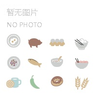
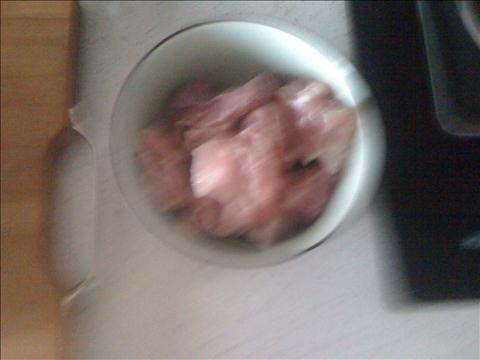
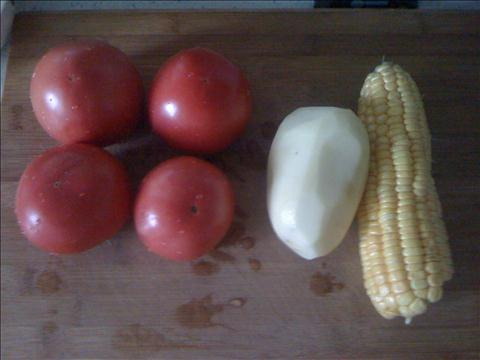
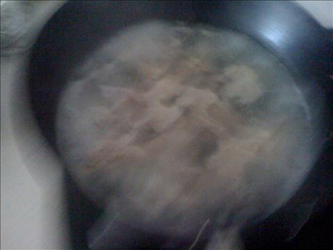
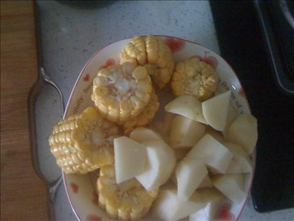
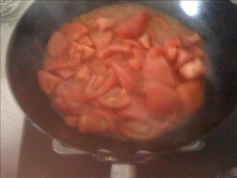

排骨玉米土豆番茄汤
===============================

## 食材 ##
* 排骨:4两
* 西红柿:4个
* 土豆:1个
* 玉米:1个

## 步骤 ##
### 1. 排骨焯水 ###
### 2. 沥出后直接放入汤煲中，汤煲加热至水费后，换小火慢炖40分钟 ###

### 3. 玉米，土豆，番茄切块备用 ###

### 3. 排骨炖至40分钟后，另启一锅，炒番茄块，热油下锅炒至出汁 ###
炒番茄可使番茄更香

### 4. 将炒好的番茄倒入炖排骨锅中，然后加入玉米土豆和盐 ###
如果汤量不足，可以适量补入一些水。
后加盐排骨更宜烂。
### 5. 小火继续炖20分钟后，待，土豆炖熟，后加入鸡精出锅，完成 ###
用筷子扎土豆块，如果土豆块可以被扎透则说明土豆已经熟了。
