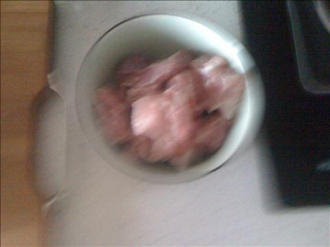

排骨玉米土豆番茄汤
===============================

## 食材 ##
* 排骨:4两
* 西红柿:4个
* 土豆:1个
* 玉米:1个

## 步骤 ##
### 1. 排骨热水下过焯一下后小火满炖40分钟 ###

### 2. 玉米，土豆切块备用 ###

### 3. 排骨炖至40分钟后，番茄切块加入油下过炒至出汁 ###
加油炒番茄可使番茄更香

### 4. 炒后的番茄倒入炖排骨锅中，加入玉米土豆和盐
可以适量补入一些水
### 5. 小火继续炖20分钟后，加入鸡精出锅 ###
