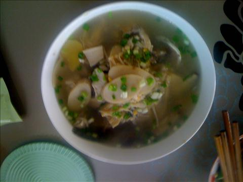
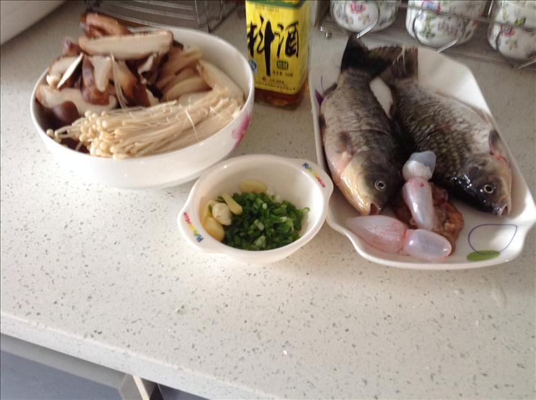
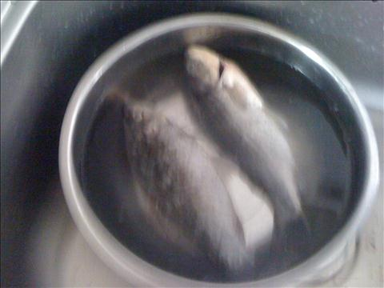
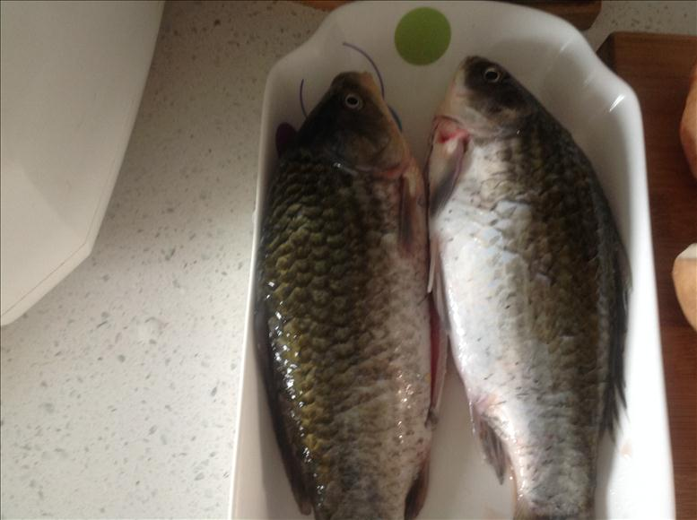
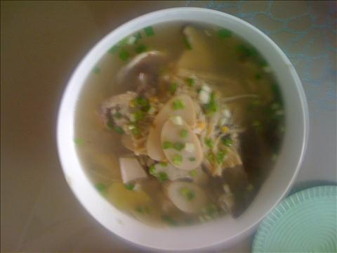

时鲜菌菇鲫鱼汤
===============================

## 食材 ##
* 鲫鱼:2条
* 鲜菇:5个
* 鸡腿菇:1个
* 金针菇:1把
* 香葱:3根
* 姜:若干

## 步骤 ##
### 1. 鲫鱼洗净 ###

### 2. 鱼身涂料酒鱼肚放入姜片腌制10分钟 ###
料酒，生姜去腥

### 3. 香葱切沫，鸡腿菇切片备用 ###
### 4. 锅中加入油，待油热，换小火，放入鲫鱼 ###
### 5. 小火煎鲫鱼 ###
入锅前用纸将鱼身上的水吸干
### 6. 加入水，盐等调料和蘑菇小火炖20分钟 ###
### 7. 加入鸡精和香葱沫出锅 ###

