韩国料理豆腐饼（煎豆腐饼）
===============================
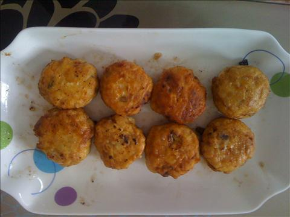

## 食材 ##
* 肉馅:2两
* 葱:1段
* 蒜:1瓣
* 豆腐:1块
* 胡萝卜:1根
* 鸡蛋:1枚
* 面粉:2小碟

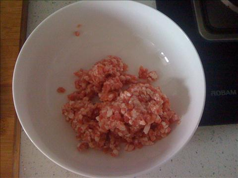

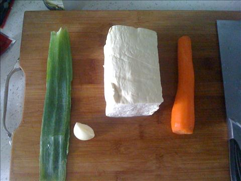

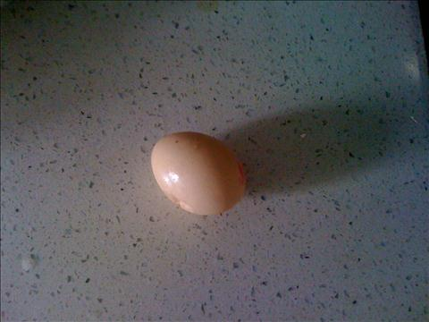

## 步骤 ##
### 1. 胡萝卜丁，葱花，蒜沫和肉馅均匀搅拌 ###
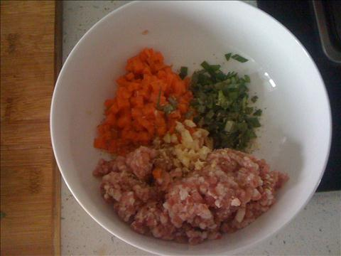

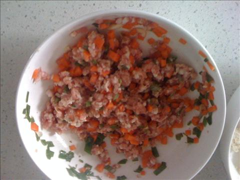

### 2. 豆腐捏成渣 ###
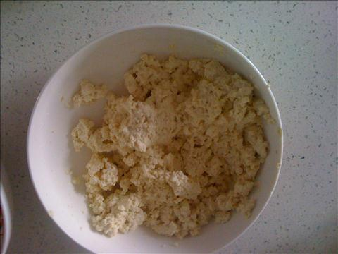

### 3. 与己之前肉馅进行搅拌 ###
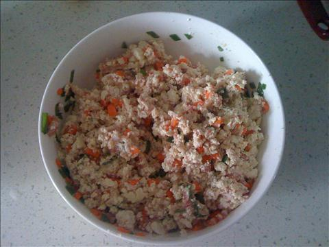

### 4. 鸡蛋打散, 取面粉备用 ###
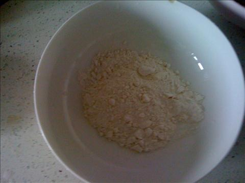

### 5. 将搅拌好的肉馅与豆腐团成饼状 ###
先团成球状，在拍扁即成饼状。

豆腐饼不要太大太厚，太厚太大不易煎熟。

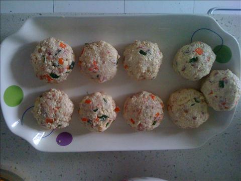

### 6. 沾上面粉后在裹上蛋液 ###
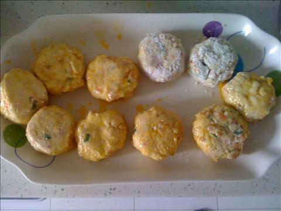

### 7. 平底锅中火两面煎至金黄 ###

