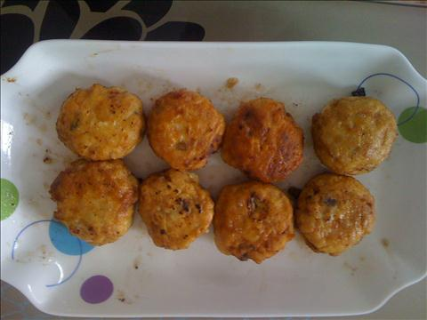
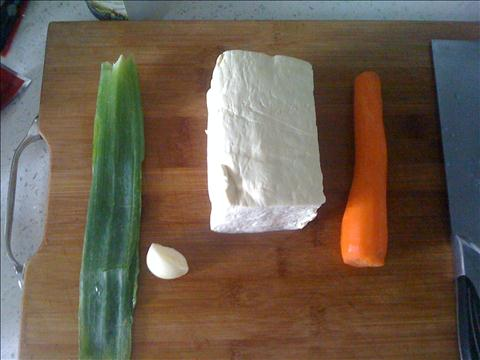
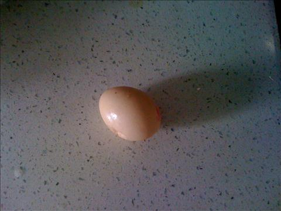
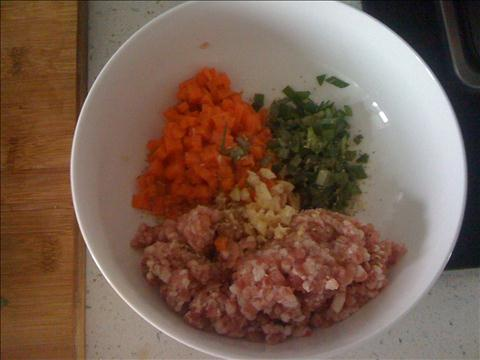
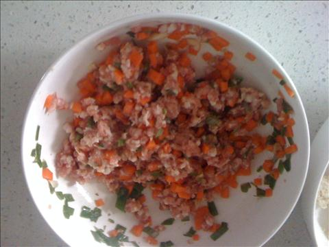
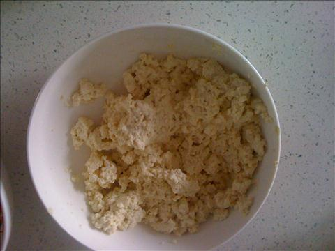
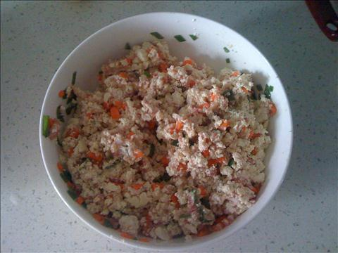
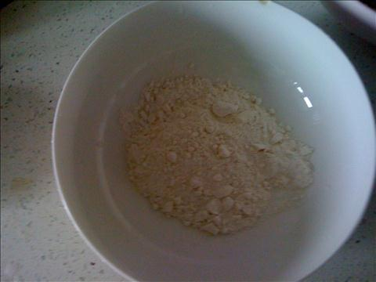
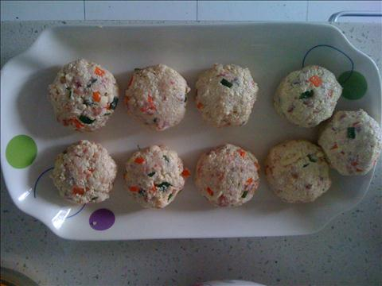
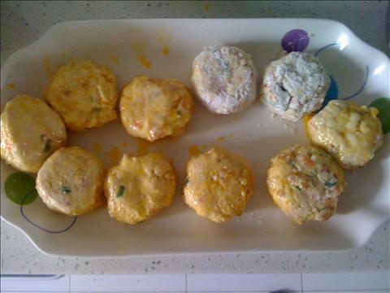

韩国料理豆腐饼（煎豆腐饼）
===============================

## 食材 ##

* 肉馅:2两
* 葱:1段
* 豆腐:1块
* 胡萝卜:1根
* 鸡蛋:1枚
* 面粉:2小碟

## 步骤 ##
### 1. 胡萝卜切丁和葱花肉馅均匀搅拌 ###

### 2. 豆腐捏成渣 ###

### 3. 与己之前肉馅进行搅拌 ###

### 4. 鸡蛋打散, 取面粉备用 ###

### 5. 将搅拌好的肉馅与豆腐团成饼状 ###

### 6. 沾上面粉后在沾上蛋液 ###

### 7. 平底锅中火两面煎 ###

