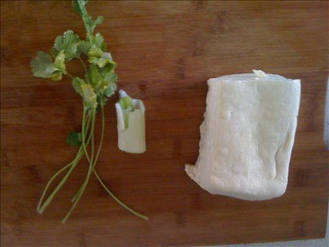
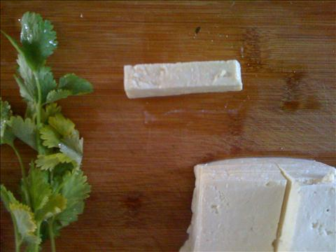
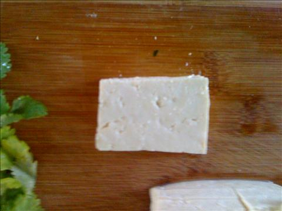
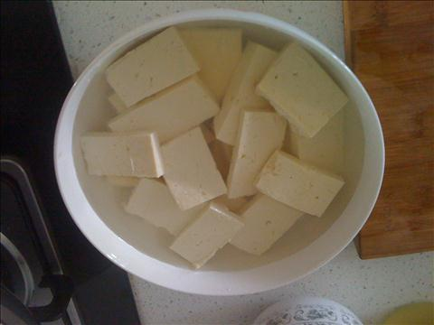

香煎豆腐
===============================

## 食材 ##
* 豆腐:1块
* 香菜:少许
* 葱花:少许

## 步骤 ##

### 1. 豆腐切块 ###
厚度为小手指指甲那么厚

### 2. 清水加盐，将豆腐放入盐水中浸泡 ###

### 3. 葱段切成 ###

### 4. 平底锅中加入油和盐 ###

### 5. 油热后调至中火，将豆腐块放入锅中煎 ###
采取晃动祸的办法防止豆腐粘锅。避免频繁翻动使豆腐碎。

### 6. 煎至两面金黄，出锅 ###

### 7. 向煎过的豆腐浇上酱油 ###
酱油选择生抽，浇时注意要均匀。

### 8. 用锅中的余油，加入葱花爆锅后，浇在豆腐上，完成###

