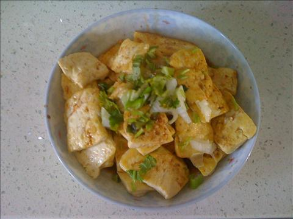
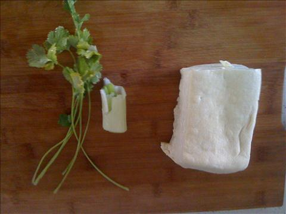
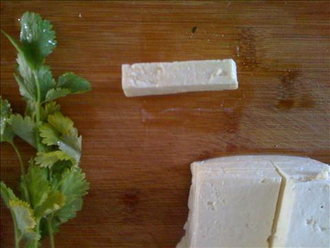

香煎豆腐
===============================

## 食材 ##
* 豆腐:1块
* 香菜,葱花:少许

## 步骤 ##
### 1. 豆腐切块 ###
豆腐块厚度为小手指指甲那么厚

### 2. 清水放入盐，将豆腐浸泡 ###

### 3. 葱段切成 ###
### 4. 平底锅大火加油，向油中加入盐 ###
### 5. 油热后调至中火，将豆腐块放入锅中煎 ###
* 少翻动，不然豆腐会碎
### 6. 煎至两面金黄，出锅 ###
### 7. 向煎过的豆腐浇上酱油 ###
注意酱油浇的均匀
### 8. 用锅中剩余的油，爆锅葱花浇在豆腐上，完成###

