豆腐木耳火腿羹
===============================
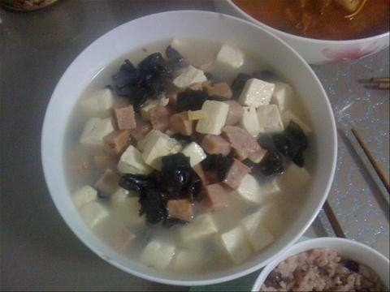

## 食材 ##
* 木耳:1把
* 火腿:梅林午餐肉1盒
* 豆腐:1块
* 葱:小段

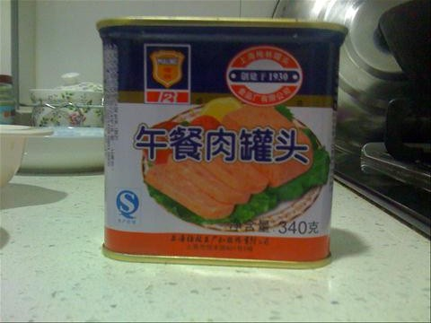

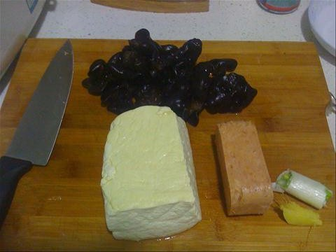
## 步骤 ##
### 1. 木耳泡发 ###
用水浸泡木耳20分左右

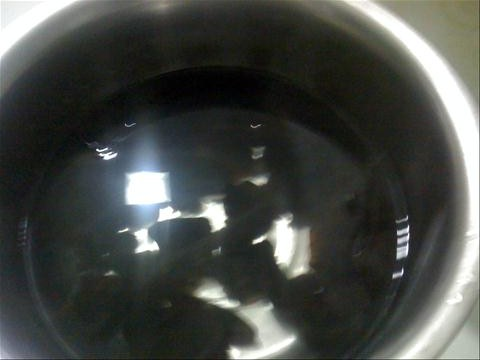

### 2. 木耳撕成小片  ###

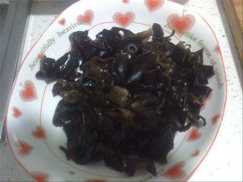
### 3. 豆腐切块 ###
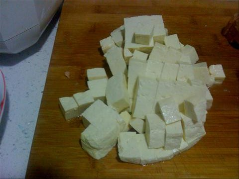

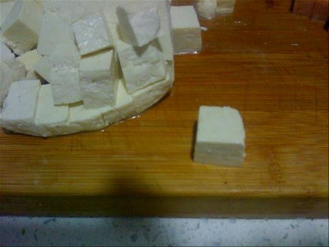
### 4. 火腿切小块  ###
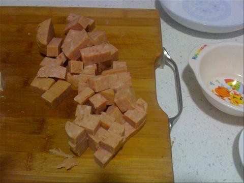

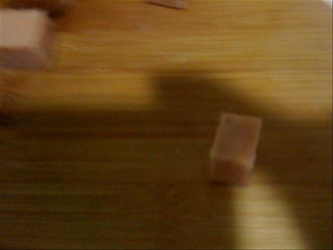

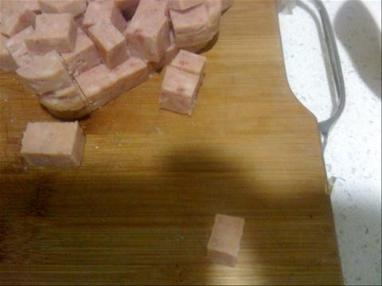
### 5. 豆腐，木耳，火腿，葱花备用 ###
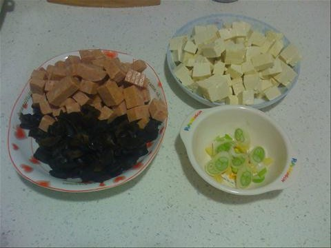
### 6. 焯木耳和豆腐 ###
用一锅水即可

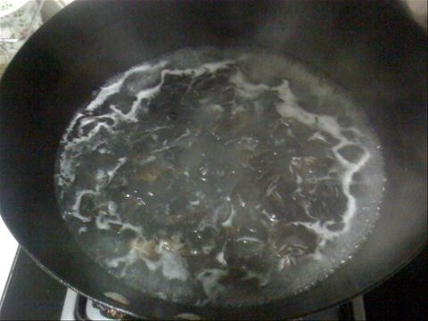

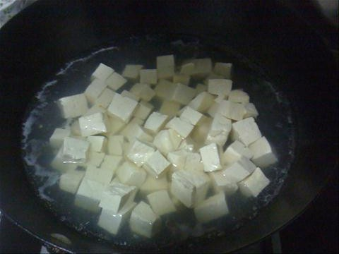
### 7. 木耳火腿葱花下过翻炒 ###

### 8. 加入水和豆腐 ###
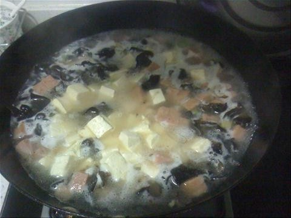
### 9. 水开后加入盐和鸡精，出锅 ###

