豆腐木耳火腿羹
===============================
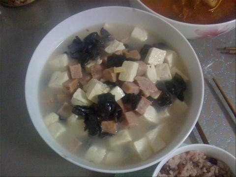

## 食材 ##
* 木耳:1把
* 火腿:梅林午餐肉1盒
* 豆腐:1块
* 葱:小段

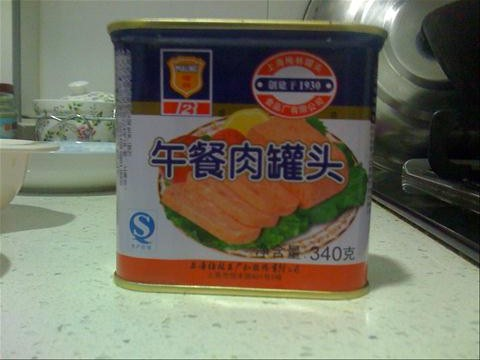

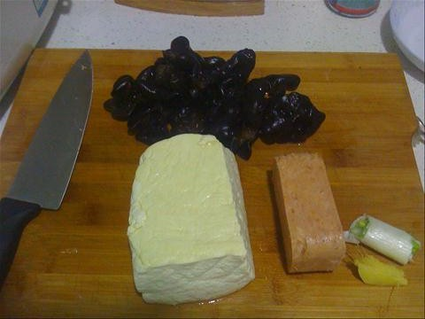
## 步骤 ##
### 1. 木耳泡发 ###
用冷水浸泡木耳20分左右

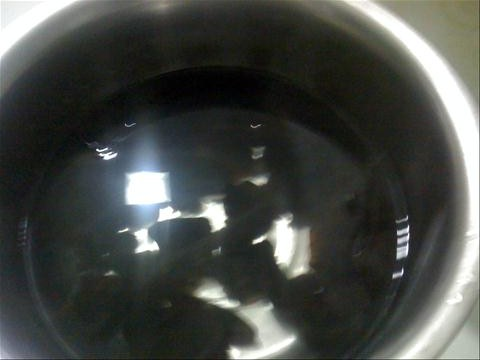

### 2. 木耳去蒂，撕成小片备用  ###
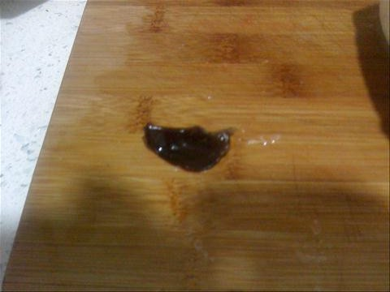

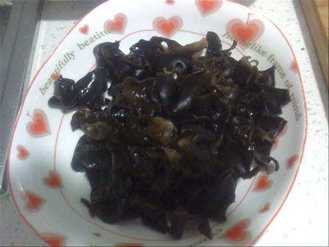
### 3. 豆腐切块备用 ###
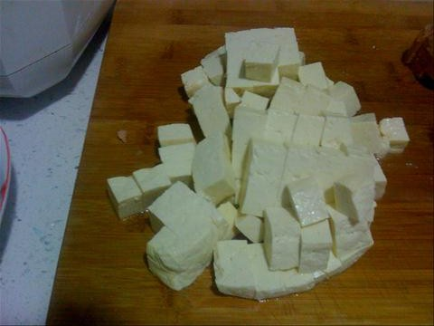

### 4. 火腿切小块备用  ###
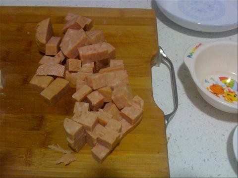

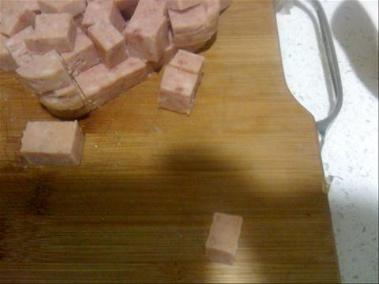
### 5. 切葱花备用 ###
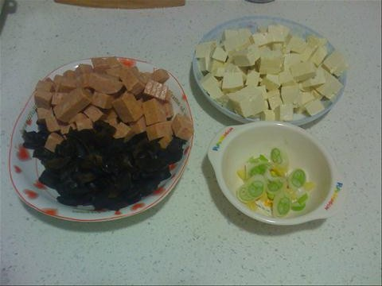

### 6. 焯木耳和豆腐 ###
沸水下锅。先焯木耳，捞出后，不用换水，接着焯豆腐。
豆腐和木耳各焯2分钟左右。

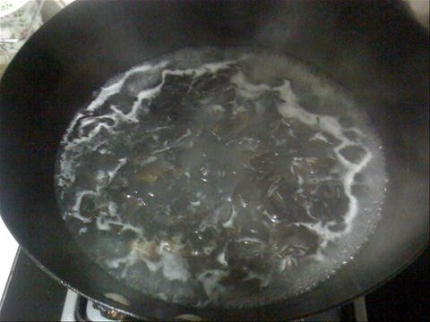

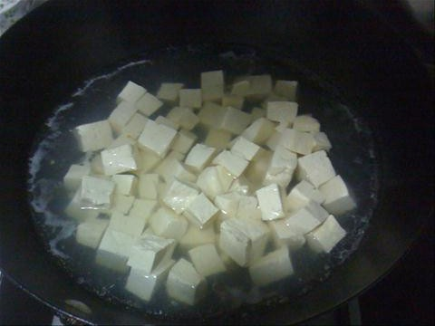

### 7. 油热后加入木耳，火腿和香葱翻炒 ###
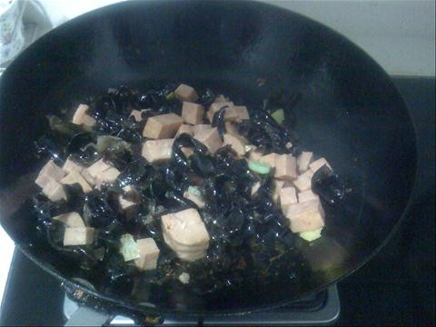

### 8. 加入水，待水沸后加入豆腐 ###
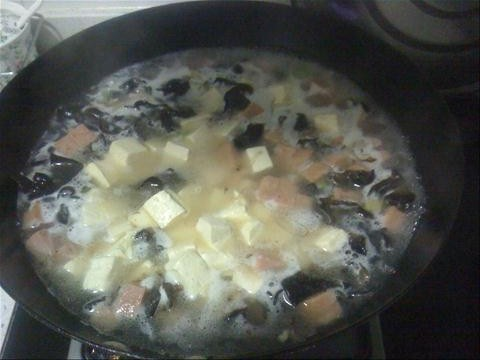

### 9. 大火煮4分钟后，关火，加入盐和鸡精，出锅。 ###

