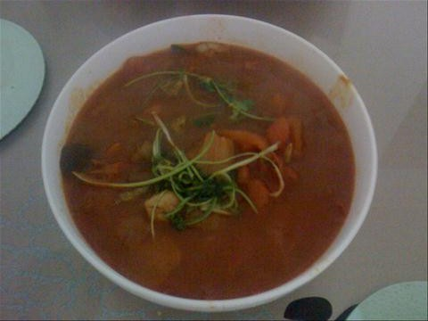
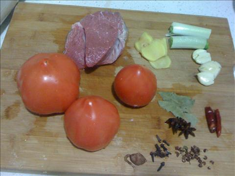
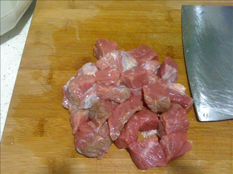
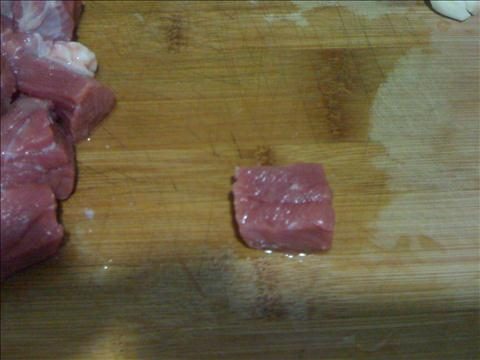
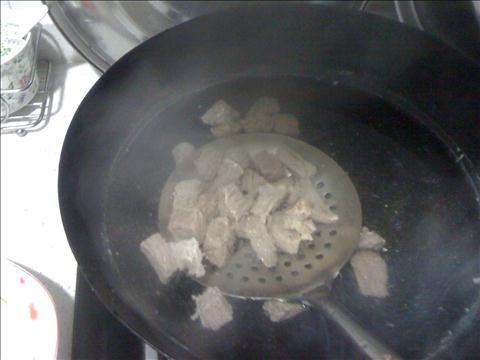
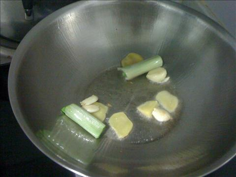
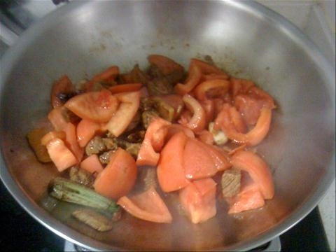
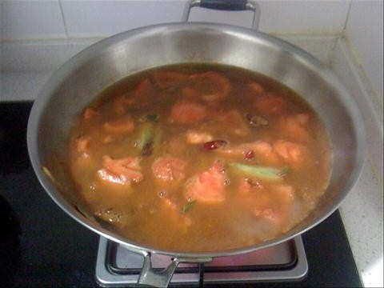

番茄牛肉汤
===============================

## 食材 ##
* 西红柿:3个
* 牛肉(上脑或牛腩):5两
* 葱姜蒜:若干
* 八角、香叶:若干

**豆蔻和丁香味道太大, 可依口味选择**

**辣椒也不宜加入**

## 步骤 ##
### 1. 牛肉和西红柿切块，备用 ###

### 2. 牛肉块焯一下 ###
冷水入锅焯，去腥和血沫

### 3. 起锅，放入葱段，姜片，大蒜爆香  ###
冷油放入葱姜蒜

### 4. 待油热后，放入牛肉转小火翻炒，期间放入料酒和生抽 ###
加入料酒去腥，加入生抽上色

### 5. 待牛肉完全上色后，加入西红柿块继续翻炒  ###

### 6. 加入热水和八角，香叶，大火至汤沸腾后，转小火炖40分钟  ###

### 7. 加入盐，转至大火收汤后加入鸡精出锅###
根据汤量而定，锅内汤太多多则大火收汤，否则，直接出锅即可。

