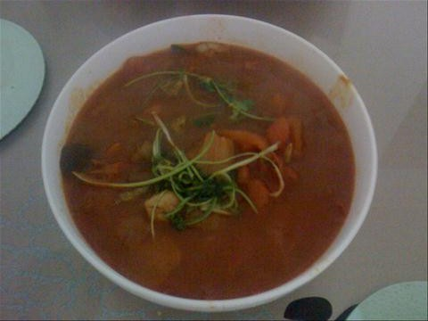
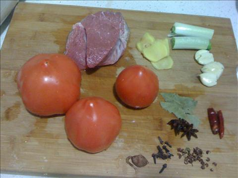
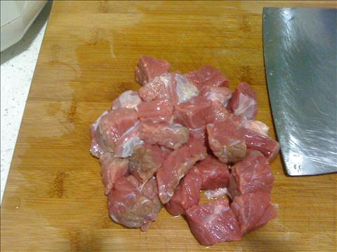
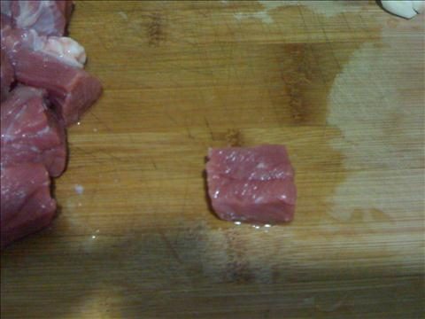
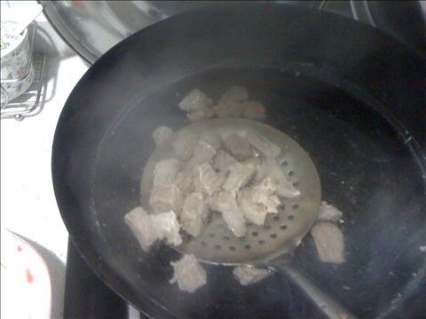
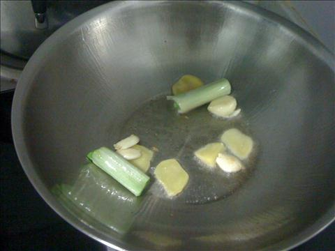
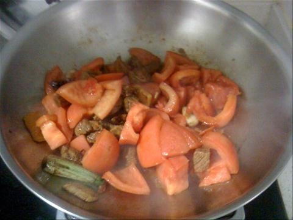
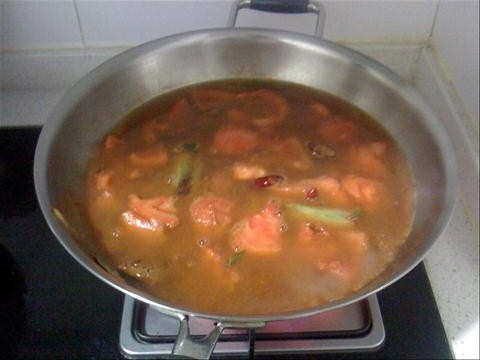

番茄牛肉汤
===============================

## 食材 ##
* 西红柿:3个
* 牛肉(上脑或牛腩):5两
* 从姜蒜:若干
* 八角、香叶:若干

**豆蔻和丁香味道太大**
**辣椒也不宜加入**

## 步骤 ##
### 1. 牛肉切块，西红柿切块 ###

### 2. 牛肉块焯一下 ###
热水入锅焯

### 3. 葱段，姜片，大蒜爆锅  ###
冷油放入葱姜蒜

### 4. 放入牛肉转小火翻炒 ###
加入料酒去腥，加入生抽上色
### 5. 牛肉完全上色后，加入西红柿块继续翻炒  ###

### 6. 加入热水和八角香叶大火至汤沸腾后转小火炖40分钟  ###

### 7. 加入盐，转至大火收汤后加入鸡精出锅###
根据汤量，入锅汤多则大火收汤

