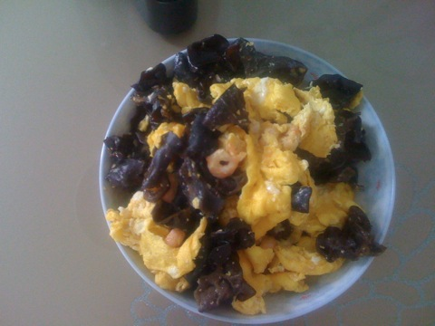
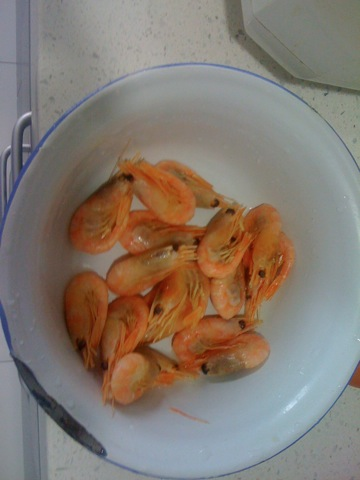
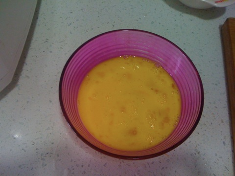
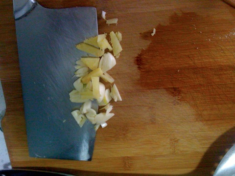
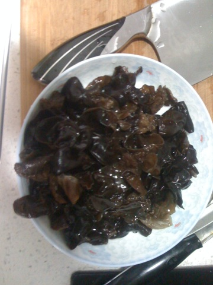
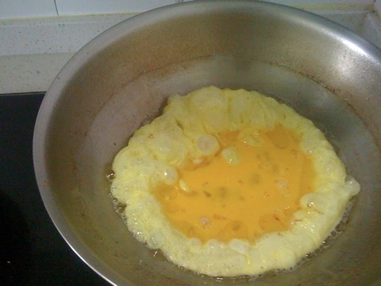
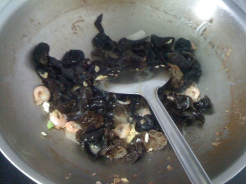

木耳鸡蛋炒虾仁
===============================

## 食材 ##
* 虾:2两
* 鸡蛋:3个
* 葱姜蒜:少许
* 木耳:1把

## 步骤 ##
### 1.虾剥皮取虾仁备用  ###
洗净，剥皮，去虾线

### 2.鸡蛋打散  ###

### 3.葱姜蒜切沫  ###

### 4.木耳泡发后洗净撕成小片  ###

### 5.热锅放油至油冒烟后，至小火加入鸡蛋，转动锅，使鸡蛋均匀摊开，成蛋饼  ###

### 6.盛出鸡蛋备用 ###
### 7.再向锅中加入少许油，油热后加入木耳和虾仁翻炒  ###

### 7.加入鸡蛋，盐继续翻炒  ###
### 8.加入调料，完成  ###
