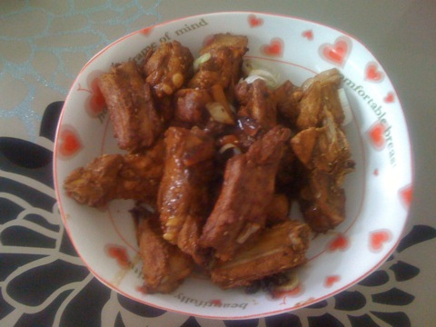
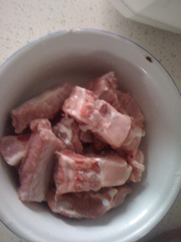
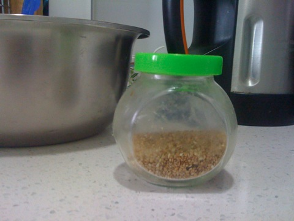
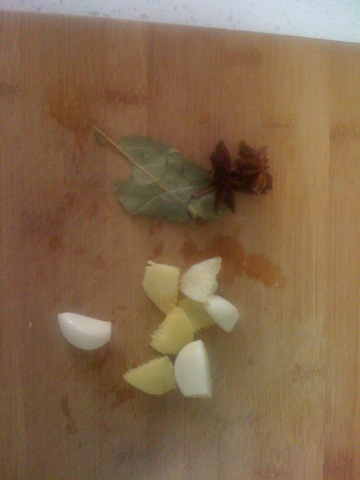
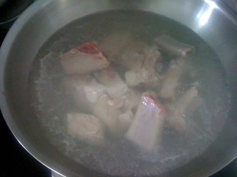
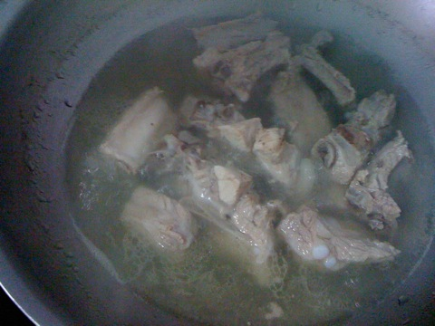
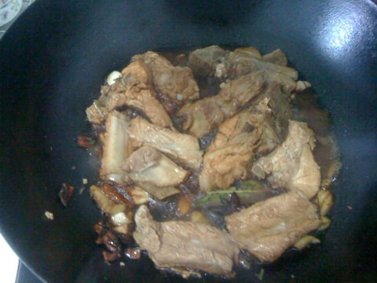
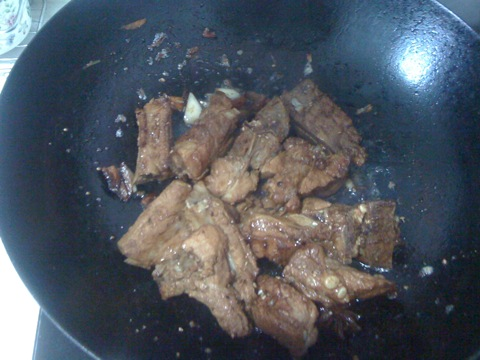

香薰排骨
===============================

## 食材 ##
* 猪肋排:0.5斤
* 芝麻:少许
* 葱姜蒜:少许
* 八角、香料:少许

## 步骤 ##
### 1. 排骨冷水入锅  ###

### 2. 煮沸3－5分钟后，开盖，撇去血沫 ###

### 3. 调制小火继续煮40分钟 ###

### 4. 将葱姜蒜切碎，放入小碗，再加入生抽，糖，醋，盐，五香粉调汁 ###

### 5. 另起一个炒锅，锅热后，加入煮好的排骨和八角香叶翻炒 ###
不要放油，调至小火干炒

### 6.将调好的调料汁和一碗煮排骨的汤一同加入炒锅 ###

### 7.换大火，收汁  ###
注意观察锅内情况，要不时翻动以免糊锅

### 8.用铲子将排骨移至锅边，向锅的另一侧加入少量油 ###

### 9.待油热后，开始煎排骨 ###

### 10.排骨煎至褐色后，加入芝麻出锅 ###

