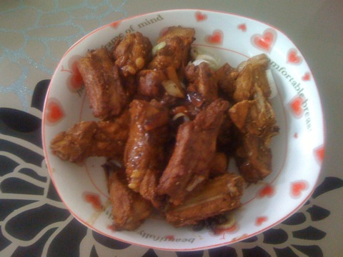
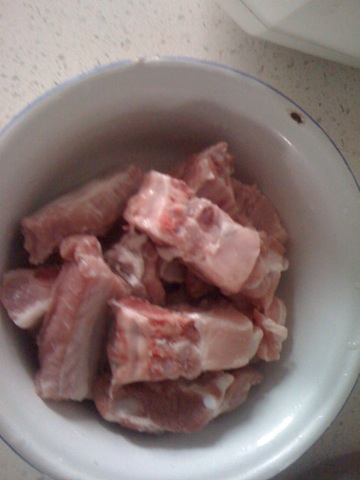
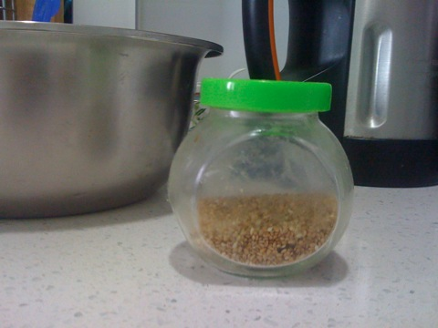
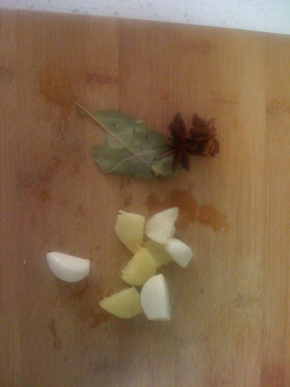
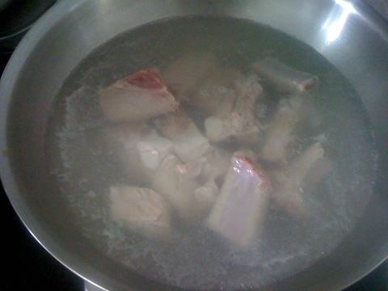
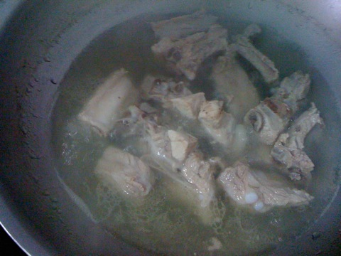
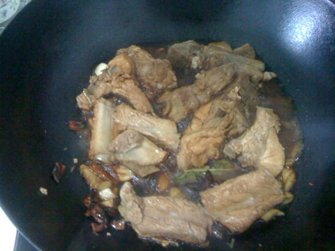
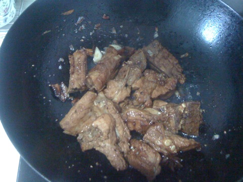

香薰排骨
===============================

## 食材 ##
* 猪肋排:0.5斤
* 芝麻:少许
* 葱姜蒜:少许
* 八角、香料:少许

## 步骤 ##
### 1. 排骨热水入锅  ###

### 2. 煮沸3－5分钟后，撇去血沫 ###
### 3. 调制小火继续煮40分钟 ###

### 4. 将葱姜蒜，生抽加入小碗调汁 ###
### 5. 另起一个炒锅开火热锅后加入煮好的排骨和八角香叶翻炒 ###
### 6.加入调料汁和一小碗煮排骨的汤 ###

### 7.大火2分钟，不时翻动以免糊锅  ###
### 8.将排骨至旁边向锅中间加入少量油，煎排骨 ###

### 9.排骨煎至褐色后，加入芝麻出锅 ###

