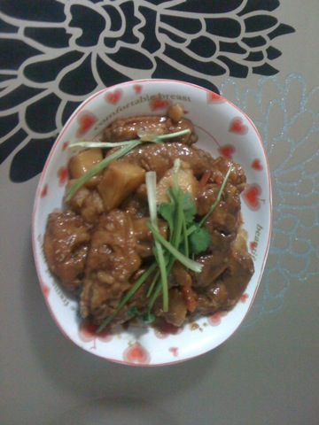
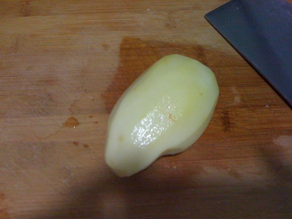
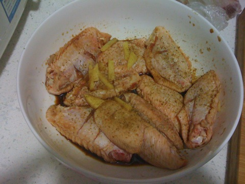
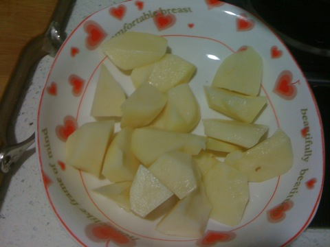
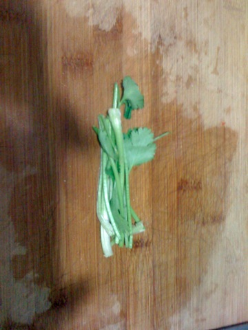
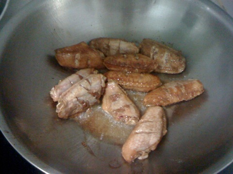
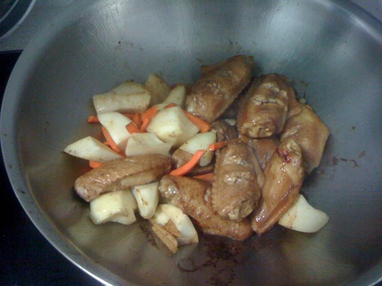
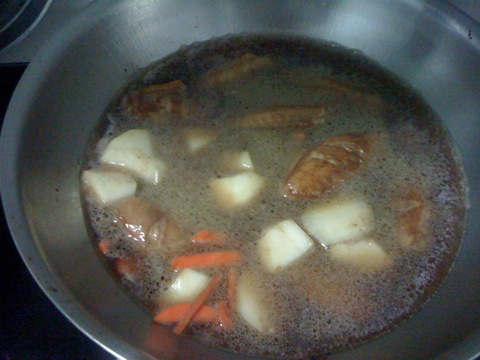
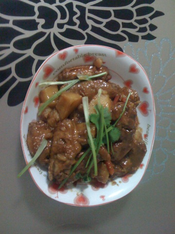
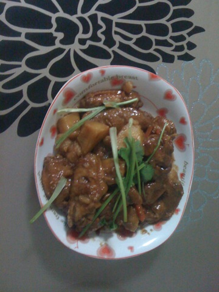

鸡翅炖土豆
===============================

## 食材 ##
* 土豆:1个
* 鸡翅:10个
* 葱姜蒜:少许
* 香菜:少许

## 步骤 ##
### 1. 鸡翅正反划口子，放入料酒，生抽，姜片腌制20分钟 ###

### 2. 土豆切块，香菜切段，备用 ###

### 3. 葱姜蒜爆锅，放入鸡翅 ###
腌鸡翅的汤也倒入锅中

### 4. 加入土豆块 ###
*由于之前家里省了一点胡萝卜，所以也把胡萝卜切条下锅一起炒了*

### 5. 加水没过鸡翅大火烧，20分  ###
注意汤汁，防止干锅

### 6. 出锅后加入香菜段 ###

