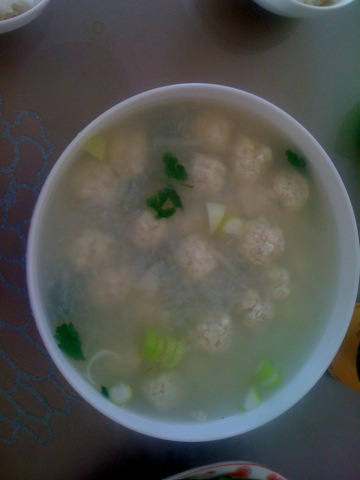
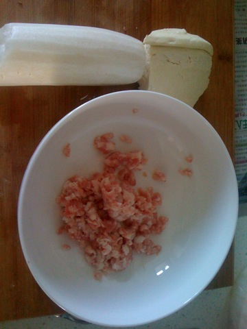
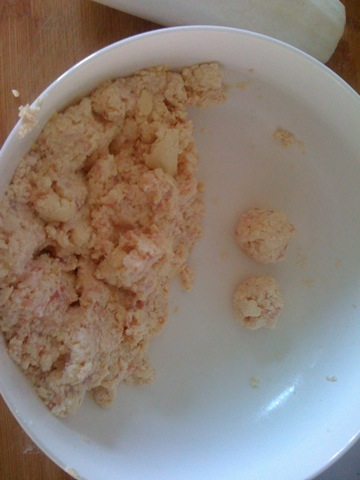
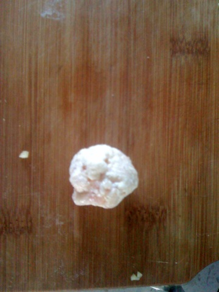
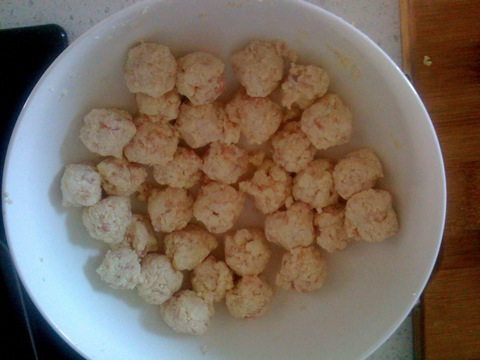
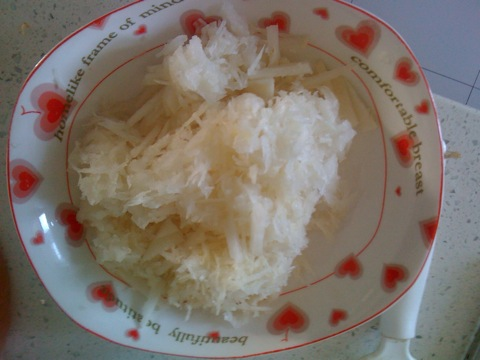
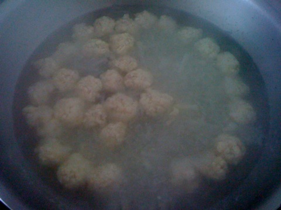

豆腐丸子萝卜汤
===============================

## 食材 ##
* 白萝卜:0.5根
* 豆腐:1块
* 肉馅:2两
* 葱末:若干

## 步骤 ##
### 1. 豆腐捏碎与肉馅混合后团成丸状 ###

### 2. 将白萝卜刨成丝 ###

### 3. 将萝卜丝与丸子下水煮至丸子浮于水面 ###

### 4. 加入葱末后出锅 ###

