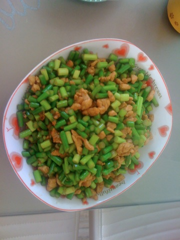
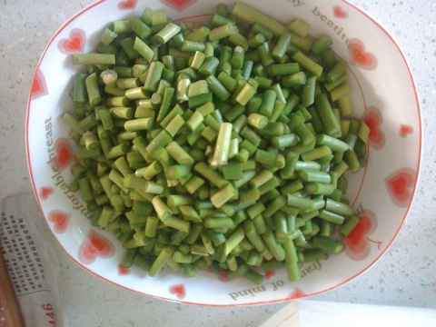
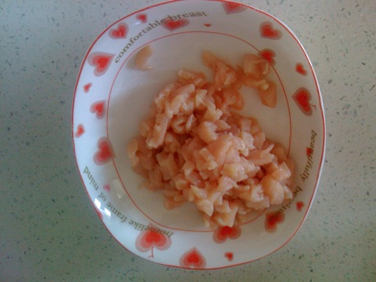
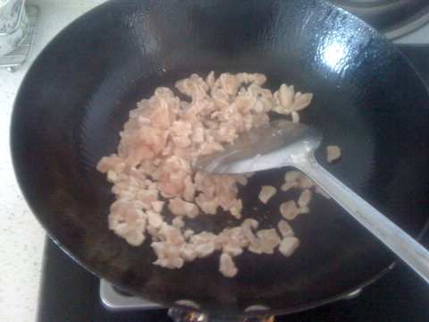
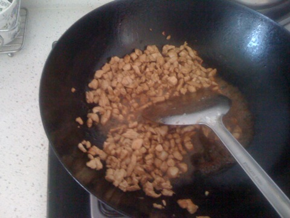

蒜苔炒鸡胸脯
===============================

## 食材 ##
* 蒜苔:1小把
* 鸡胸脯肉:4两
## 步骤 ##
### 1.蒜苔切丁  ###

### 2.鸡胸脯切丁  ###

### 3.油热后，鸡丁下锅翻炒  ###

### 4.加入料酒，生抽  ###

### 5.鸡丁均匀上色后，加入蒜苔  ###
### 6.加入盐翻炒至蒜苔熟透后加入鸡精出锅  ###
