锅包肉
===============================
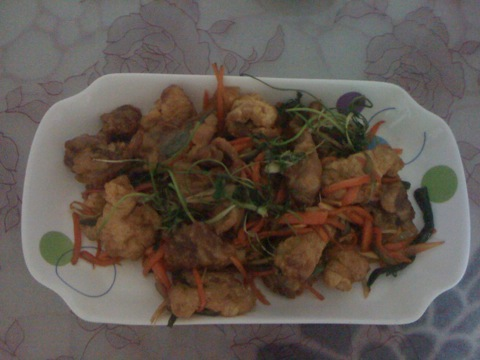

## 食材 ##
* 胡萝卜:0.5根
* 猪肉:1块
* 姜:1块
* 葱:0.5根
* 鸡蛋:2个

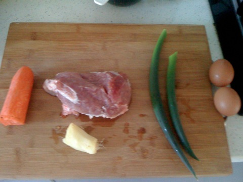
## 步骤 ##
### 1.猪肉切大片  ###

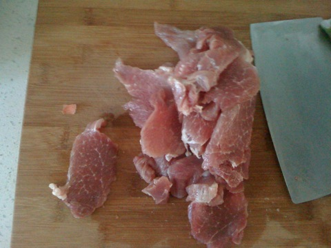

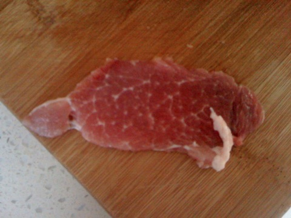
### 2.葱姜胡萝卜切丝备用  ###
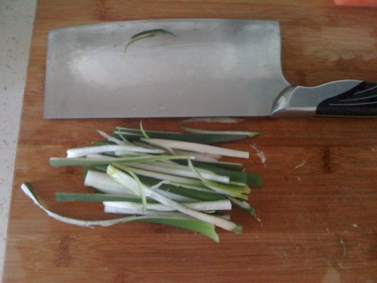

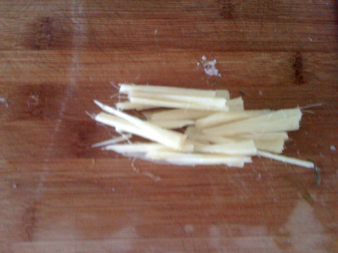

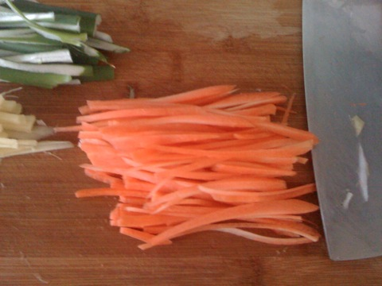

### 3.生抽，糖，醋，盐调汁备用  ###
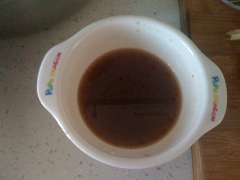

### 4.鸡蛋打开后取清  ###
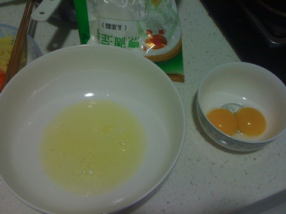

### 5.向蛋清中加入淀粉，搅拌成糊状  ###
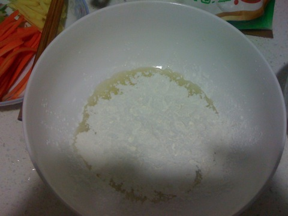

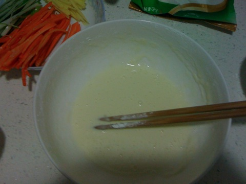

### 6.向锅内倒油，大火加至油热，换中火 ###

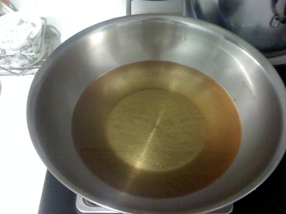
### 7.待油热后，换中火，将肉片放入清淀粉糊反转，使肉片裹上一层蛋清淀粉糊，然后下入油锅炸。##
待全部炸好后，需再复炸一遍

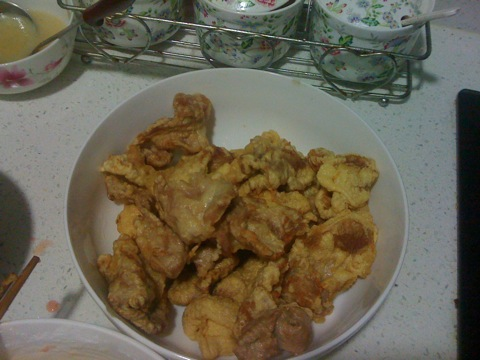
### 8.锅内留少量油后将葱姜胡萝卜丝下锅，翻炒  ###

### 9.翻炒后加入汁和肉，翻炒后出锅 ###

