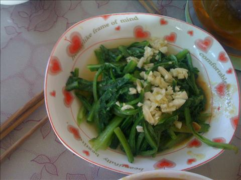

清炒油麦菜
===============================

## 食材 ##
* 油麦菜:4两
* 大蒜:0.5头

## 步骤 ##
### 1. 油麦菜洗净，切成大段，备用 ###

### 2. 大蒜切成蒜沫，备用 ###

### 3. 起锅，放入油 ###

### 4. 待油热后，放入油麦菜翻炒 ###

### 5. 加入蒜沫和盐继续翻炒一会儿后，加入鸡精出锅 ###

注意，时间不要太久断生即可
