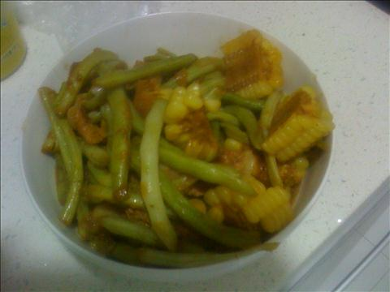
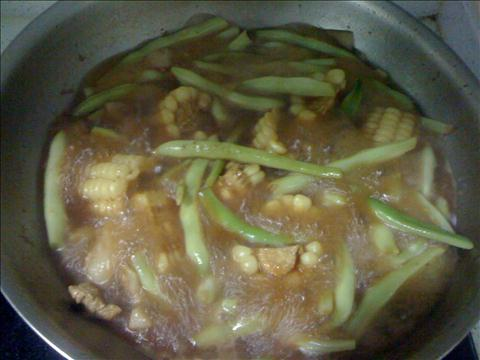

玉米豆角炖肉
===============================

## 食材 ##
* 玉米:1穗
* 豆角:0.5斤
* 猪肉:4两
## 步骤 ##
### 1.猪肉切片  ###

### 2.玉米切块  ###

### 3.热油下肉翻炒，待肉泛白后加入豆角继续翻炒  ###

### 4.加入水，放入玉米，大火加热至水沸，加入盐，五香粉 ###

### 5.换小火，继续炖20分钟左右 ###

### 6.关火，加入鸡精，出锅 ###

