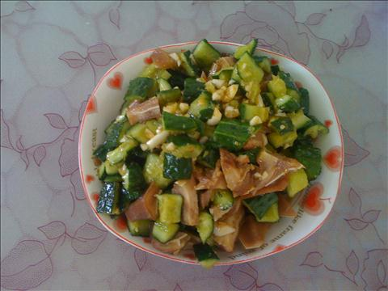
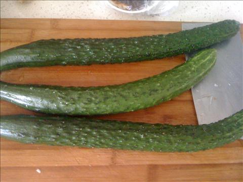
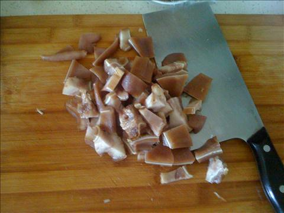
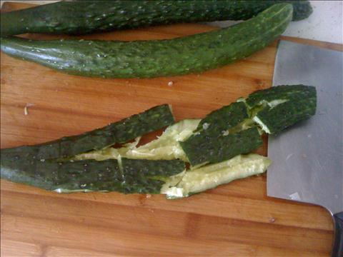
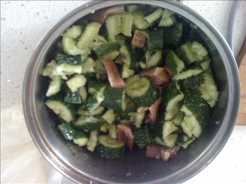
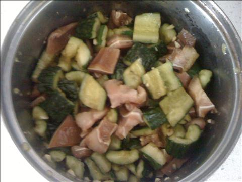

猪耳朵拌黄瓜
===============================

## 食材 ##
* 熟猪耳朵:4两
* 大蒜:若干

* 黄瓜:3根

## 步骤 ##
### 1.猪耳朵切小块  ###

### 2.黄瓜用刀拍碎后，切块  ###

### 3.将黄瓜和猪耳朵放入较大容器内  ###

### 4.加入葱末，蒜末，生抽，盐，鸡精后均匀搅拌  ###

### 5.盛盘即可食用 ###

