菠萝咕咾肉
===============================
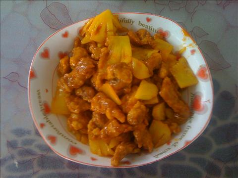

## 食材 ##
* 猪肉:0.5两
* 菠萝:0.5个
* 鸡蛋:1个
* 淀粉:若干
* 番茄酱:若干
* 生抽:若干
* 糖:若干
* 醋:若干
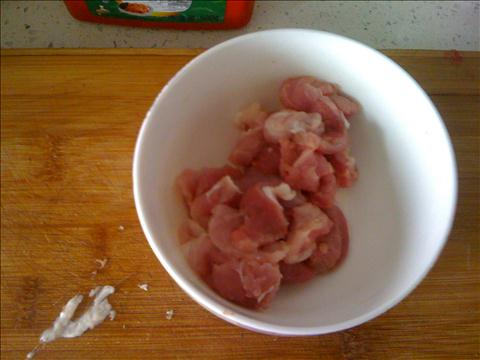
## 步骤 ##
### 1. 猪肉切片 ###
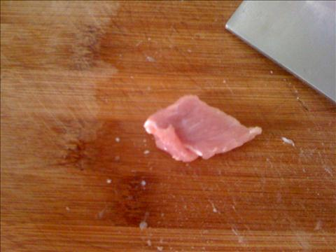

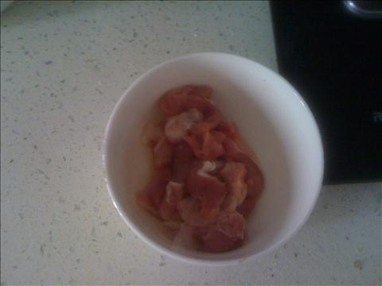
### 2. 鸡蛋打散搅匀，放入肉片搅拌  ###
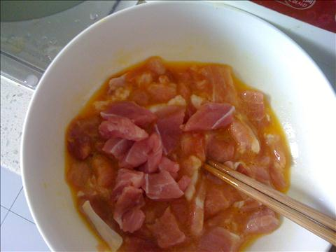
### 3. 加入淀粉，搅拌，使所有肉片都裹上淀粉  ###
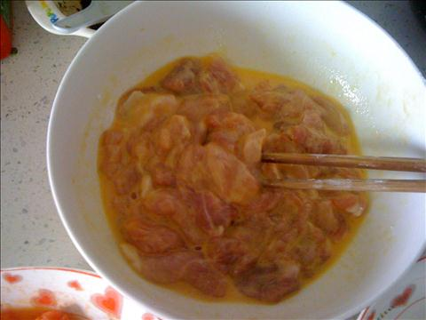
### 4. 国内倒入油加热后将肉片一片片下入油锅中炸 ###
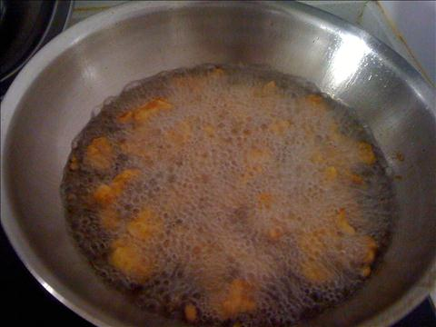
### 5.  炸至金黄捞出后复炸一遍 ###
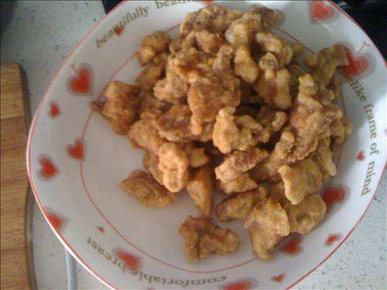
### 6.  菠萝切片 ###
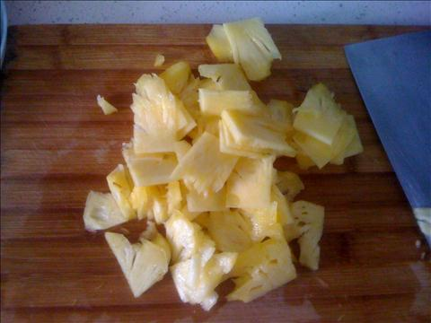
### 7. 国内倒入少量油，加入番茄酱，糖和醋，加热至番茄酱冒泡 ###
不停搅拌锅中的番茄酱汁，防止糊锅

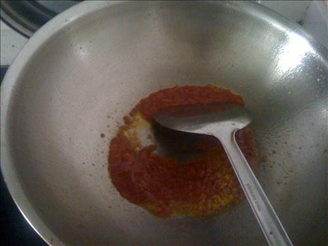
### 8.倒入炸好的肉段和菠萝下锅翻炒 ### 
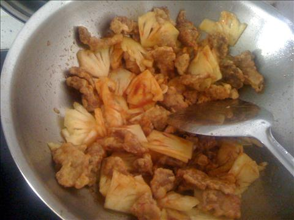
### 9.带菠萝和肉段均匀上色后出锅 ###
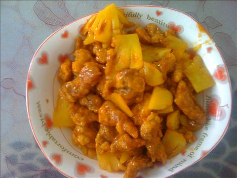

