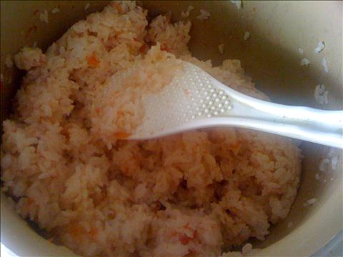
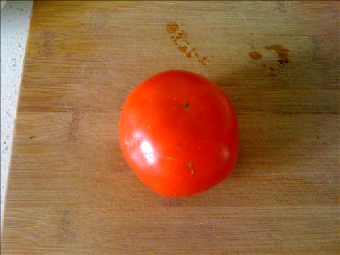
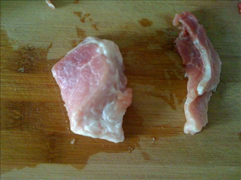
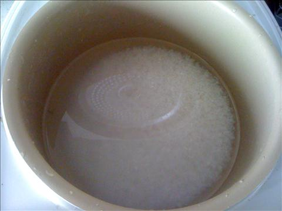
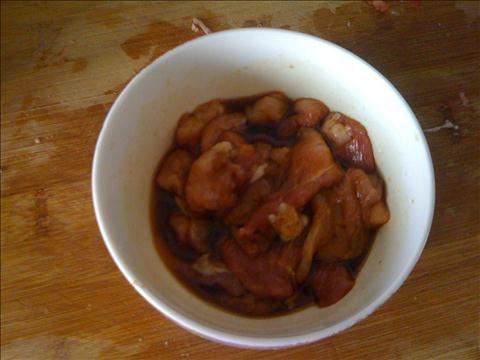
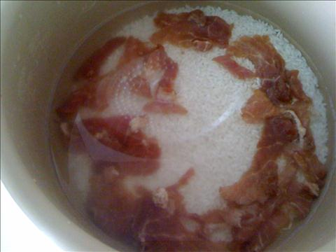
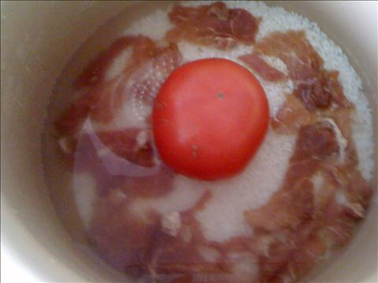
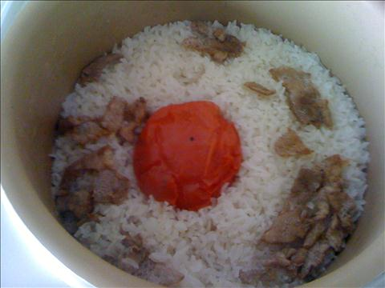

西红柿米饭
===============================

## 食材 ##
* 大米: 若干
* 西红柿:1枚
* 猪肉:2两

## 步骤 ##
### 1. 米洗净后加入水泡半小时 ###

### 2. 猪肉切薄片放入生抽调料腌制十分钟 ###

### 3. 将肉片平摆至米饭上 ###

### 4. 西红柿去蒂摆在米饭上后开始煮饭  ###

### 5.煮好后，用饭铲将西红柿压碎，加入盐，鸡精和少量白胡椒均匀搅拌 ###

