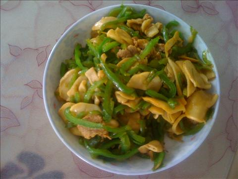
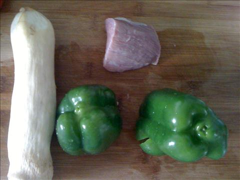
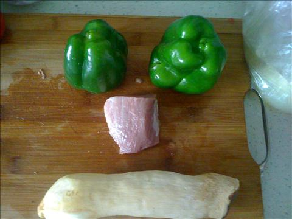
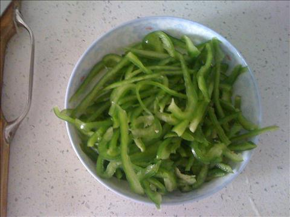
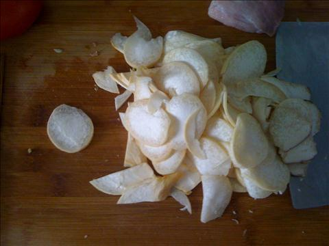
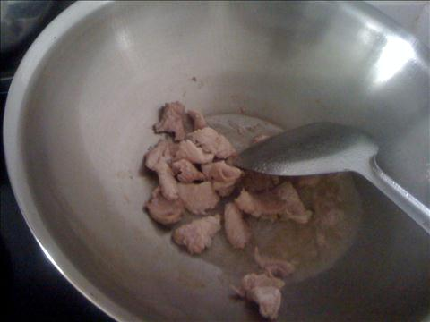
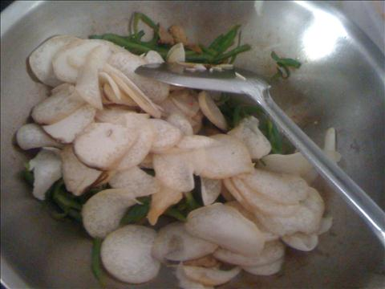

杏鲍菇青椒炒肉
===============================

## 食材 ##
* 杏鲍菇:1个
* 青椒:2个
* 猪肉:2两

## 步骤 ##
### 1. 杏鲍菇洗净，青椒去蒂洗净，猪瘦肉洗净备用 ###

### 2. 青椒，去蒂，洗净后，切丝备用 ###

### 3. 杏鲍菇洗净后，切片备用 ###

### 4. 炒锅内放入少许油，待油热后下入肉片，翻炒  ###
加入料酒去腥，生抽调味上色

### 5. 加入杏鲍菇和青椒丝，同时加入盐等调料，继续翻炒 ###

### 5. 翻炒至杏鲍菇和青椒断生，即可 ###

