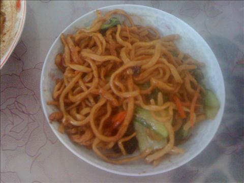
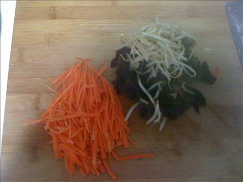
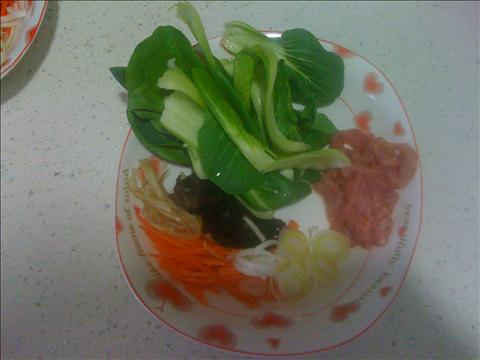

快手炒面
===============================

## 食材 ##
* 面条:1斤

* 胡萝卜:0.5根

* 豆芽:若干

* 瘦肉:2两

* 木耳:两片

* 葱:少许

* 姜:少许

* 青菜:少许

## 步骤 ##
### 1. 木耳提前泡发，备用 ###

### 2. 豆芽，青菜，摘洗后备用  ###

### 3. 胡萝卜洗净切丝，瘦肉切丝，木耳切丝，生姜切丝，切葱花 ###

### 4. 面条下入沸水锅中煮熟，用凉水过一遍，备用 ###

### 5. 起锅，加入油，待油热后，姜丝爆锅 ##
下入肉丝，翻炒，期间加入酱油等调料

### 6.  待肉丝均匀上色后， 加入胡萝卜，木耳，继续翻炒 ###

### 7. 待蔬菜断生后， 下入面条，加入生抽，翻炒至面条均匀上色后出锅 ###

