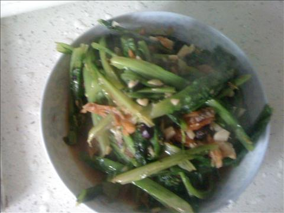
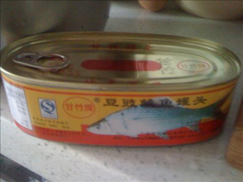
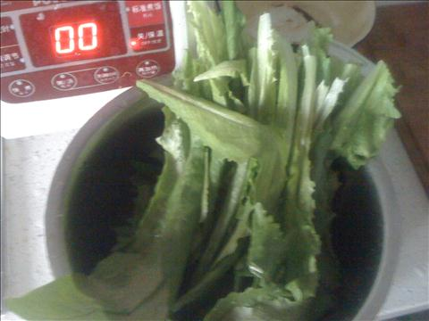
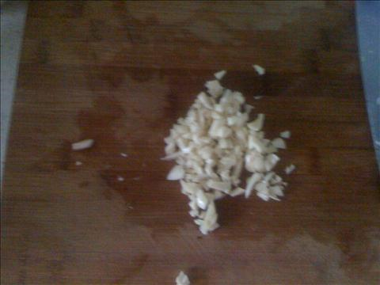
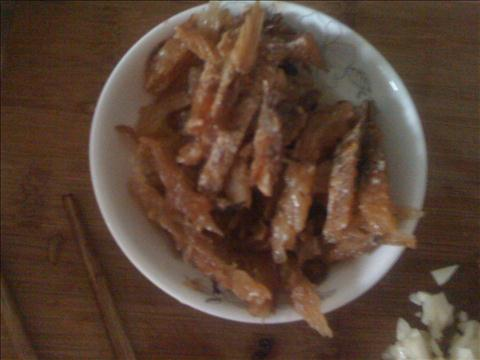
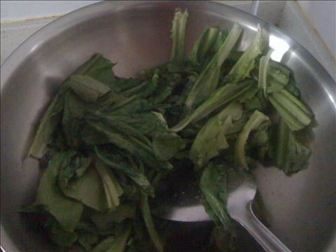
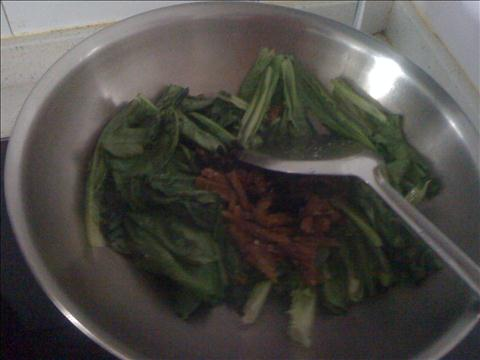

豆豉鲮鱼油麦菜
===============================

## 食材 ##
* 油麦菜:4两

* 大蒜:5瓣

* 豆豉鲮鱼罐头:0.5盒

## 步骤 ##

### 1. 油麦菜摘好，洗净  ###

### 2. 大蒜剥皮，切成蒜沫 ###

### 3. 罐头打开，将鱼切成小块，放入盘中备用  ###

### 4. 向锅内加入油，待油热后下油麦菜，翻炒 ###

### 5. 翻炒几下后，立即加入鲮鱼，蒜沫和盐等调料继续翻炒后出锅 ###

