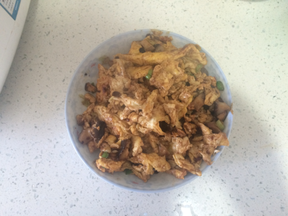

酱炒蛋
===============================

## 食材 ##
* 鸡蛋:5个
* 葱:0.5根
* 大酱:少量
## 步骤 ##
### 1. 鸡蛋打入碗内, 用筷子打撒成蛋液 ###

### 2. 葱切成葱花备用 ###

### 3. 起锅，热油，待油热后，调制小火，倒入鸡蛋 ###
边倒鸡蛋，边摇晃锅，使鸡蛋摊开，成饼状，并避免粘锅。

### 4. 待鸡蛋定型后，加入大酱，调料和葱花，翻炒  ###

### 5. 放入少量鸡精，出锅 ###
