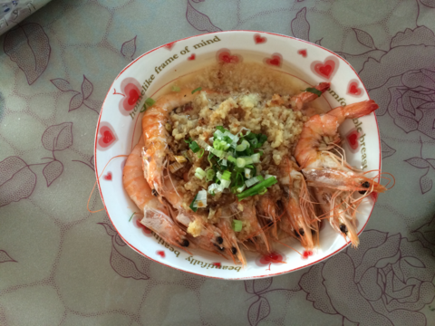
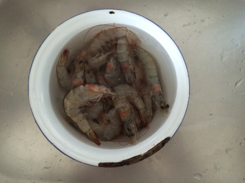
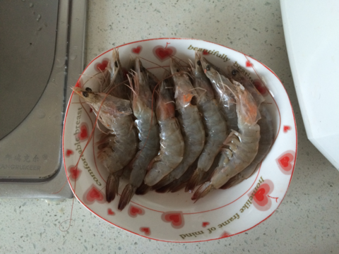
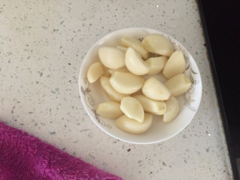
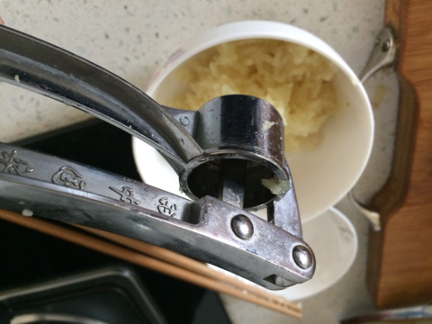
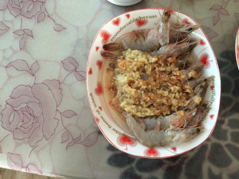

蒜蓉蒸虾
===============================

## 食材 ##
* 大虾:15只

* 大蒜:1头

* 香葱:少许

## 步骤 ##
### 1. 大虾洗净，从背部剪开一个小口去掉虾线  ###

### 2. 将处理好后的大小摆盘 ###

### 3. 大蒜剥皮，制成蒜沫 ###

### 4. 向锅内加入油，油量大概略小于蒜量，待油热后，关火 ###

### 5. 向锅内加入蒜，盐，糖，等调料 ###

### 6. 简单翻炒后浇在大虾上 ###

### 7. 将大虾放入蒸锅，蒸十分钟左右 ###

### 8. 香葱切沫，待大虾出锅后撒上香葱沫 ###

