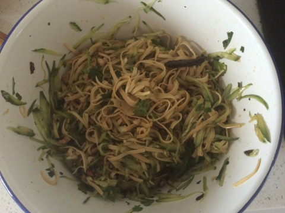

家常凉菜
===============================

## 食材 ##
* 干豆腐皮:2张
* 黄瓜:2根
* 香菜:2两
* 里脊肉:2两
* 大蒜:0.5头
* 干辣椒（辣椒末）:少许
* 花椒，大料:少许

## 步骤 ##
### 1. 干豆皮，冲洗后，切丝备用  ###

### 2. 黄瓜洗净后，切丝备用  ###
斜刀，切大片

### 3. 香菜切段，大蒜切末，干豆腐丝，黄瓜丝，大蒜末放入大碗中  ###
容器要足够大，方便拌匀。

### 4. 起锅，放入适量油，待温热，立即关火，放入干辣椒和辣椒末，制成辣椒油 ###
也可以油热后，淋在干辣椒和辣椒末上。

注意油温不宜过热，否则辣椒会糊。

### 5. 将辣椒油淋在干豆丝，黄瓜丝和大蒜末上 ###

### 6. 加入，生抽，糖，醋，盐，鸡精 ###

### 7.  用筷子拌匀后，盛盘 ###

