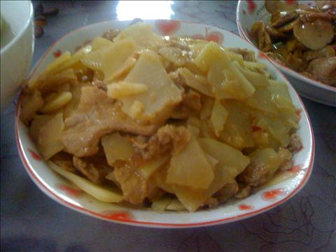
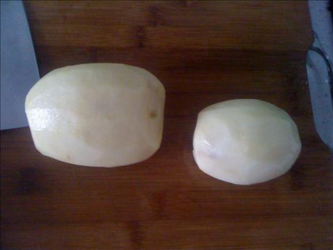
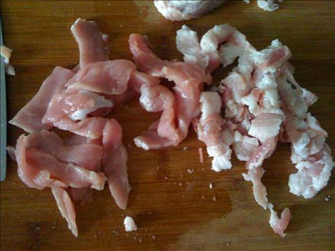
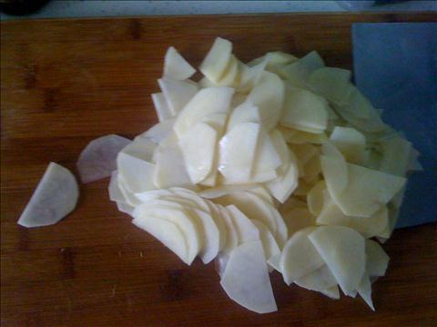
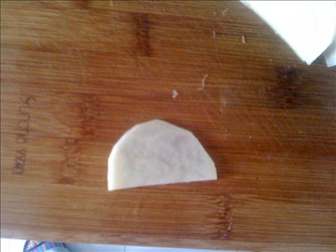
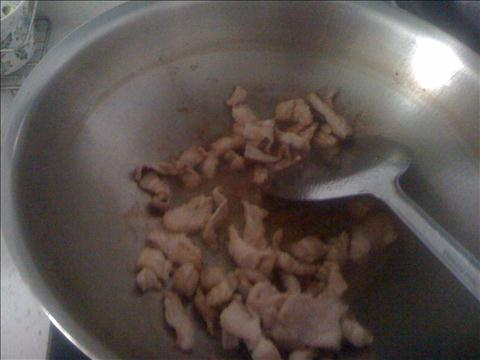
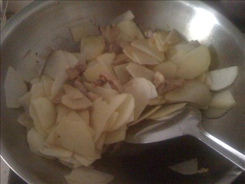

五花肉炒土豆片
===============================

## 食材 ##
* 五花肉:4两
* 土豆:2个
* 葱姜蒜:若干

## 步骤 ##
### 1. 五花肉切片  ###

### 2. 土豆切片  ###

### 3. 葱花爆锅后，放入五花肉片翻炒  ###

### 4. 待肉片泛白后，加入土豆片  ###
### 5. 翻炒两下后，加入盐等调料，继续翻炒 ###

加少许水，可以防止土豆干锅

### 6. 待土豆片熟后，盛盘完成 ###
