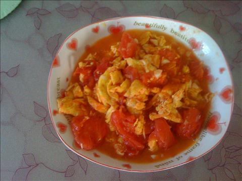
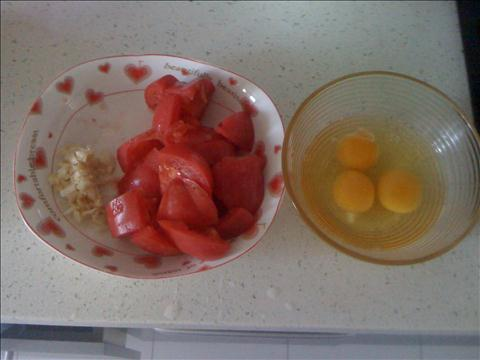
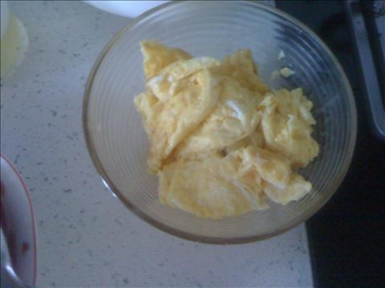

西红柿炒鸡蛋
===============================

## 食材 ##
* 西红柿:2个
* 鸡蛋:3或4个
* 大蒜:2瓣
## 步骤 ##
### 1. 西红柿切块，备用 ###
### 2. 鸡蛋打到碗里，备用 ###
### 3. 大蒜切蒜沫，备用 ###

### 4. 锅内放入油，待油热后，关小火，将鸡蛋均匀摊入锅中 ###

### 5. 鸡蛋熟后，盛出备用 ###
### 6. 加入油，待热后下入西红柿块翻炒 ###

西红柿吃油，可多加入一些油。

### 7. 翻炒一会后，加入鸡蛋，蒜沫和盐等调料继续翻炒，后出锅 ###

