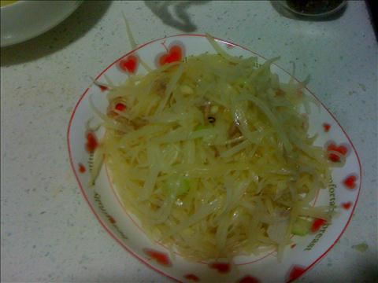

土豆丝
===============================

## 食材 ##
* 土豆:2个
* 瘦肉:1两
* 葱蒜:若干

## 步骤 ##
### 1. 土豆切丝 ###

注意均匀，均匀比细更重要

### 2. 将切好的土豆丝放入水中浸泡十分钟左右  ###

尽量选的大容器，适量增加些醋可以增强土豆丝的硬度

### 3. 瘦肉切丝，葱切花，蒜切沫备用  ###

### 4. 放入葱花蒜沫爆锅，然后加入肉丝翻炒 ###

### 5. 待肉丝泛白后，加入土豆丝进行翻炒 ###

### 6. 待土豆丝炒软后，即可出锅  ###
