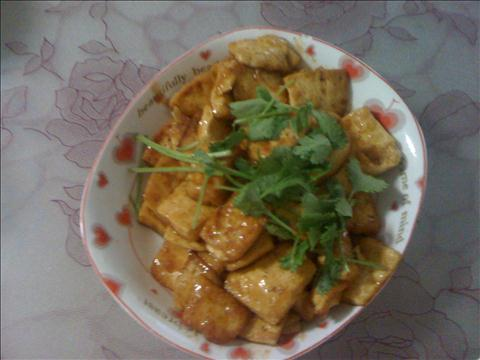
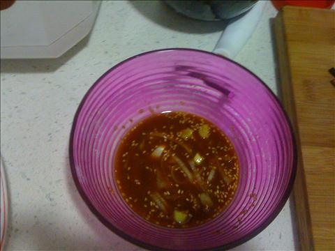
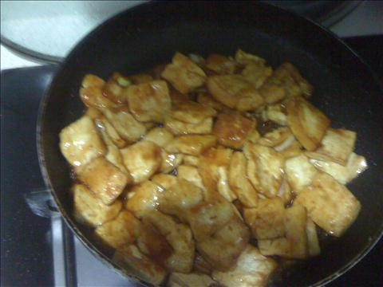

糖醋煎豆腐
===============================

## 食材 ##
* 豆腐:1块
* 葱:少许
* 芝麻:少许
* 香菜:少许

## 步骤 ##
### 1. 向小碗内加入生抽，糖，醋，芝麻和葱花，调汁备用  ###

### 2. 豆腐切块，备用 ###

### 3. 向平底锅内加入油，待油热后，调至小火，放入豆腐块 ###

### 4. 小火慢煎，多翻面，避免豆腐糊锅 ###

### 5. 豆腐两面煎至金黄后，导入料汁，上色均匀后，关火出锅 ###

### 6. 香菜切大段，做点缀 ###

