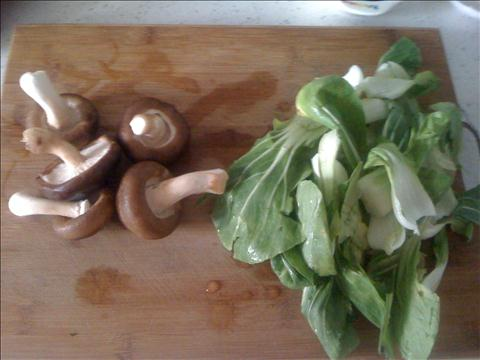
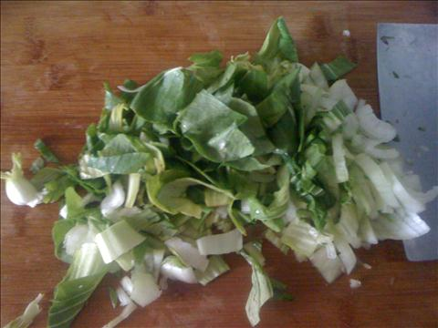
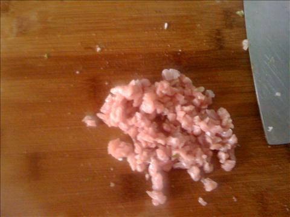
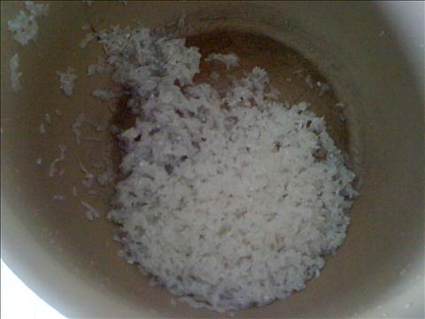

香菇瘦肉粥
===============================

## 食材 ##

* 大米:1碗

* 香菇:4枚

* 青菜:2两

## 步骤 ##
### 1. 香菇洗净后备用 ###

### 2. 青菜洗净，剁碎，备用 ###

### 3. 瘦肉剁馅，备用 ###

### 4. 大米，淘洗干净，后加入适量水放入电饭煲中 ###

### 5. 将鲜菇，青菜，肉馅加入电饭煲 ###

### 6. 使用煮粥档位 ###

### 7. 待电饭煲跳闸后，盛出即可食用 ###

