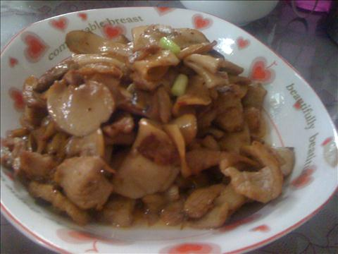
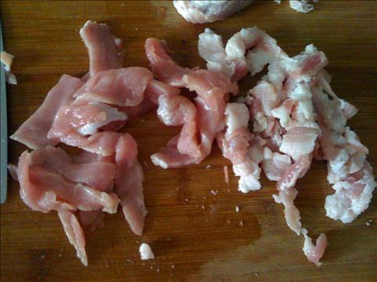
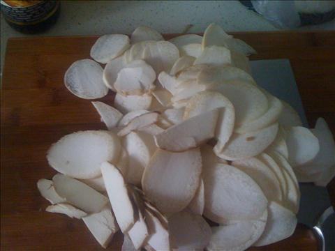
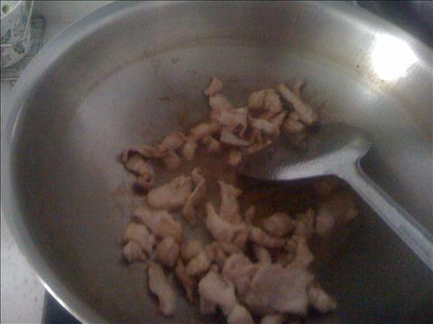
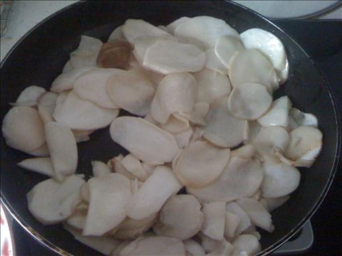

杏鲍菇炒肉片
===============================

## 食材 ##
* 猪肉:4两
* 杏鲍菇:1个
## 步骤 ##
### 1. 杏鲍菇洗净，切片 ###

### 2. 猪肉洗净，切片 ###

### 3. 炒锅内放入少许油，待油热后下入肉片，翻炒 ###

加入料酒去腥，生抽调味上色

### 4. 加入杏鲍菇，翻炒几下后，加入盐等调料，继续翻炒 ###

### 5. 炒至杏鲍菇熟，即可出锅 ###
