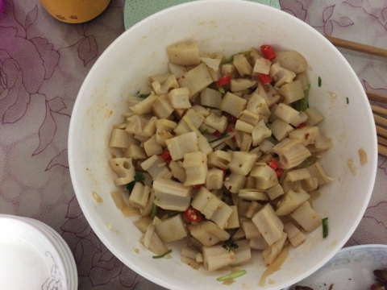
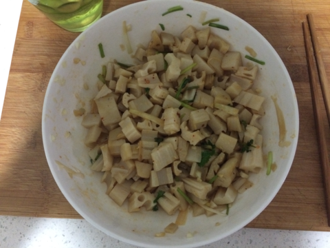

 凉拌藕丁
===============================

## 食材 ##
* 藕:2根
* 葱姜蒜:若干
* 香菜:若干
* 红辣椒:2根
## 步骤 ##
### 1. 藕去皮切丁 ###

### 2. 向藕丁中加入盐、姜末和蒜末腌制30分 ###

### 3. 用生抽，糖，醋，红辣椒块，鸡精，香菜等调料调汁 ###

### 4. 将料汁加入腌制好的藕丁中，均匀搅拌成盘 ###
