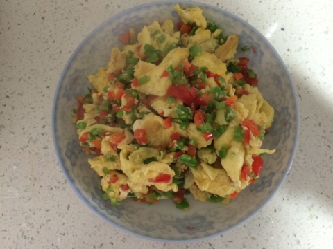
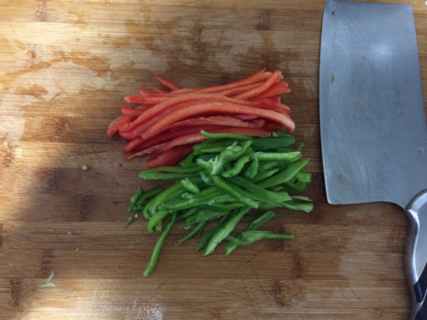
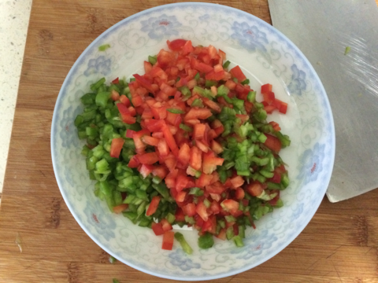
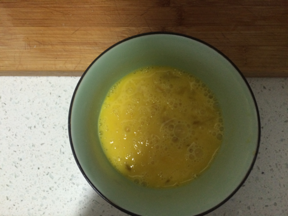

青红椒炒鸡蛋 
===============================

## 食材 ##
* 青尖椒:1根
* 红花椒:1只
* 鸡蛋:4个

## 步骤 ##
### 1. 青椒和花椒洗净切丁备用 ###

### 2. 鸡蛋打散备用 ###

### 3. 冷锅下油，待油热后关小火，倒入鸡蛋 ###

### 4. 摇动锅，使鸡蛋均匀摊开，待鸡蛋固化后盛出备用 ###

### 5. 再次向锅中加入少量油，待油热后加入辣椒丁、鸡蛋和辣椒丁，翻炒后出锅 ###

