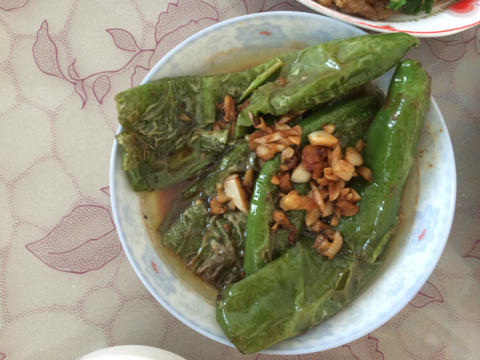
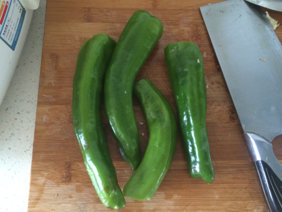
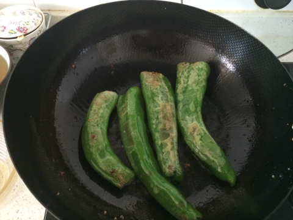
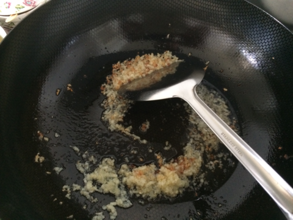

虎皮尖椒
===============================

## 食材 ##
* 尖椒:4只
* 大蒜:0.5头

## 步骤 ##

### 1. 尖椒洗净，去缔  ###

### 2. 大蒜去皮，切末备用 ###

### 3. 糖、醋、盐、生抽调汁备用 ###

### 4. 锅中倒入油，待油四层热时，下入尖椒 ###

### 5. 小火，两面煎，剪时可轻轻压扁尖椒 ###

### 6. 待尖椒两面起皮后，键入料汁 ###

### 7. 将尖椒盛出，下入蒜末煸香 ###

### 8. 再次下入尖椒，翻炒后出锅 ###
