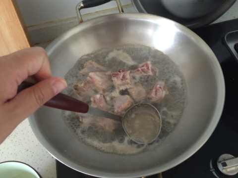

排骨冬笋萝卜汤
===============================

## 食材 ##
* 猪肋排:7块
* 冬笋:1个
* 白萝卜:0.5根
* 香葱:若干
* 香菜:少许

## 步骤 ##
### 1. 排骨洗净，焯一下，撇去浮沫，捞起 ###

### 2. 锅中加水，排骨，姜片，料酒，醋，少量糖，八角，香叶，小火煲40分钟 ###

### 3. 冬笋去皮，切片备用 ###

### 4. 萝卜去皮，切片备用 ###

### 5. 排骨煲40分钟后，开盖，加入冬笋，萝卜和盐，继续煲20分钟 ###

### 6. 关火，撒入香葱和香菜后出锅 ###

