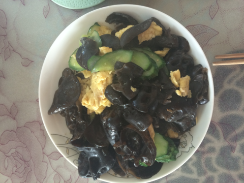
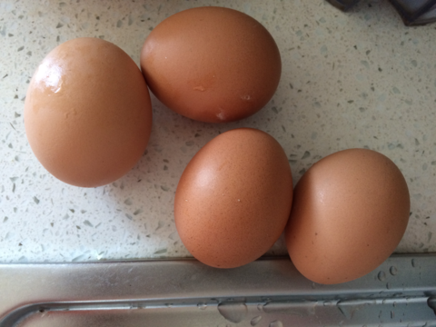
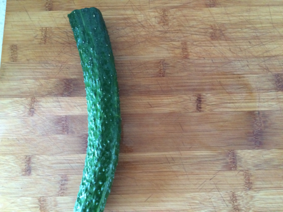
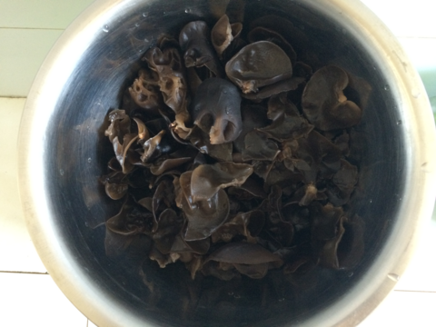
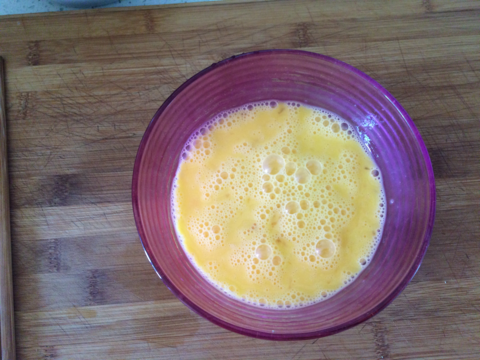
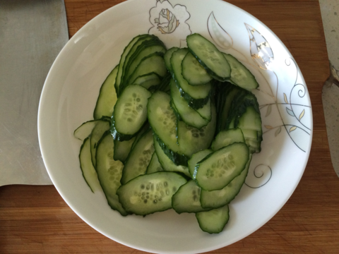

木耳黄瓜炒鸡蛋
===============================

## 食材 ##
* 鸡蛋:4个
* 木耳:1把
* 黄瓜:1根

## 步骤 ##
### 1. 木耳泡发 ###
### 2. 鸡蛋打撒 ###

### 3. 黄瓜切片  ###

### 4. 起锅放入油，待油热后关小火，将打散的鸡蛋均匀倒入锅中  ###

### 5. 待鸡蛋饼成型后，盛出鸡蛋备用 ###

### 6. 再次加入油，待油热后，下入黄瓜片和木耳 ###

### 7. 加入鸡蛋和调料继续翻炒，待熟后，加入鸡精出锅 ###
