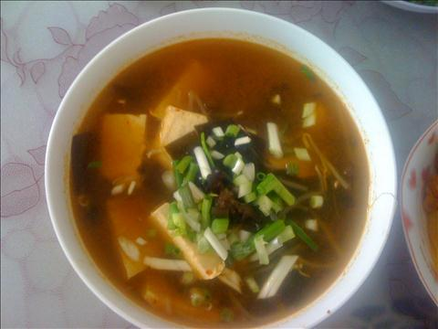
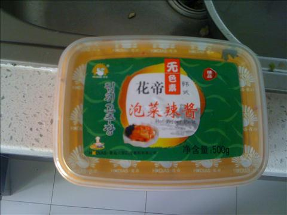
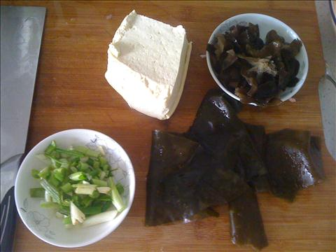
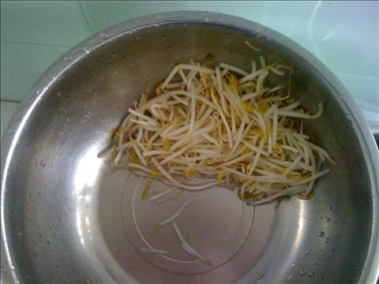
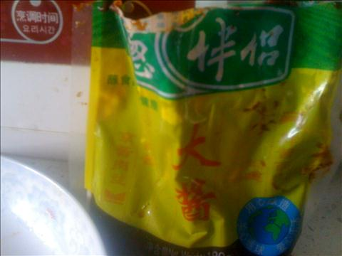
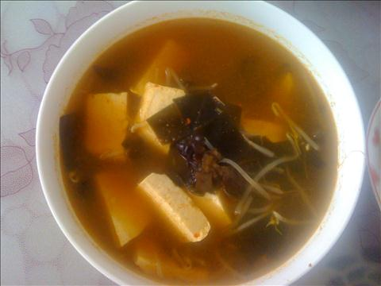

海带豆腐味蹭汤
===============================

## 食材 ##
* 朝鲜辣酱:3勺

* 豆腐:1块

* 木耳:2两

* 香葱:2两

* 豆芽:2两

* 大酱:3勺

## 步骤 ##

### 1. 木耳泡发，海带泡水，香葱切小段，豆芽洗净，备用 ###

### 2. 将泡好的海带，放入锅中焯一下，捞出沥干，备用 ###

### 3. 向锅内加入热油，放入豆芽，海带翻炒 ###

### 4. 向国内加入热水，朝鲜辣酱和大酱，再加入豆腐，盐等调料一同煮 ###

### 5. 五分钟左右，关火，加入鸡精，后出锅 ###

### 6. 加入香葱段提香 ###

